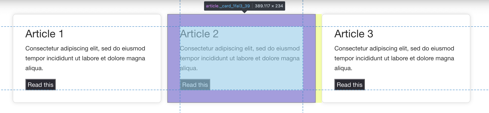
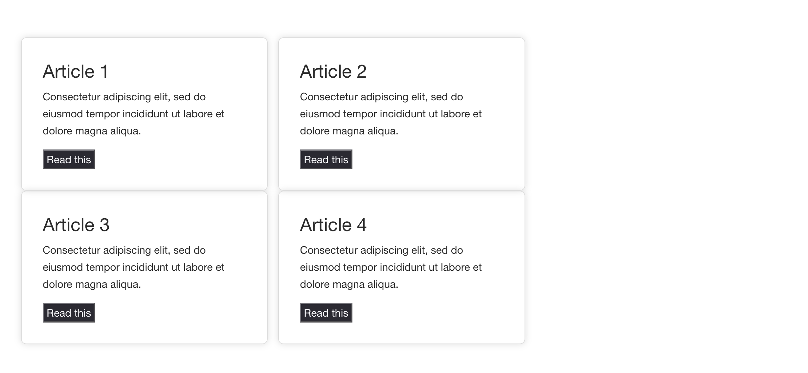
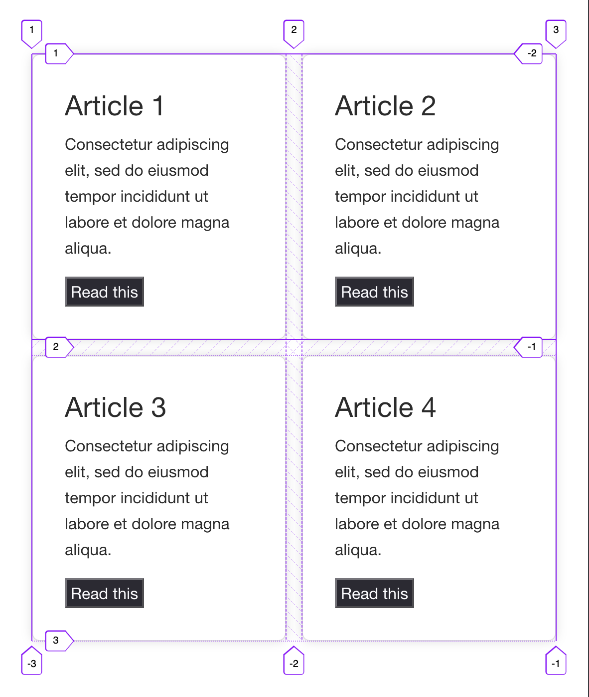

Over the years I have come to realise that I regularly use 2 simple concepts to help me write clean, maintainable code, architect systems and to apply consistent concepts in reviewing and refactoring code.

Initially I didn't realise consciously what I was doing; it was more like a spider-sense tingling when something felt wrong or right. After a while, I noticed a lot of experienced developers intuitively apply these ideas, saying things like "it's cleaner", or "it's more reasonable this way". This is because these are not "new" concepts _per sé_, rather they are a new way of looking at some old ideas, like "separation of concerns", abstraction and functional programming, to name a few. Once I started to apply them mindfully, I found it much easier to know where parts of my code belonged and to reason about architectural decisions.

## Areas of Responsibility

The first concept is the idea of "Areas of Responsibility" (AoR), it is essentially the same as the "concern" in the idea of "separation of concerns", but with a couple of extra observations about them. An AoR is a _discrete_ area of elements that are _related_ by a _specific purpose_ - for example the space and things inside a garden, or the street running alongside the garden. Each is made up of elements that fulfil a specific purpose and it would be inconvenient if the two areas were mixed together; if you tried to grow vegetables in the street or someone tried to drive through your garden!

### Characteristics of Areas of Responsibility

1. AoRs are discrete areas or groups of elements or actions that are related by a specific purpose or "concern".
1. AoRs can be nested within each other, creating a hierarchical structure.
1. AoRs are defined by their purpose or what they do, which is typically expressed by the language used to describe them. Consequently that will be verbs or nouns that express groupings or actions.
1. AoRs work best when they have a single responsibility, which is to say that they are focussed on a single purpose or action. This is the principle of "separation of concerns".

Breaking that down a bit, in the above garden/street example, _the area inside garden_ is an AoR, and so is _the area inside_ the vegetable bed, which, furthermore, might have rows of for different vegetables, is itself an AoR - this is an example of how AoRs naturally nest inside each other, with the most nested being the most specific AoR. The "responsibility" of a vegetable bed is to grow vegetables rather than, for example, growing grass or storing books - this shows, the language we use indicates the responsibilities and the specificity of purpose. Equally, the garden is a natural place to store tools to help with growing things; if they were stored elsewhere, they would be hard to access when working on the garden. More on this below - but this demonstrates grouping by purpose.

In the context of programming, an application, a class or a module represent fairly high-level AoRs. While functions, data structures, loops and conditionals, all have greater and greater specificity of responsibility. In more concrete terms, imagine an array utility module that contains a pure function, `splitIntoOddsAndEvens`. The module has a general purpose of providing array manipulations, while this specific function has a more precise responsibility to take an array of data and return 2 arrays, one of only odd numbers and one of only even numbers. In order to do that, it likely iterates over the data and in the iteration, there is likely some logic whose responsibility it is to divide the original data into the numbers that are odd and the numbers that are even...

From this we can infer that code inherently creates AoRs, and they naturally nest. These might be more or less "concrete", but it is clearly the nature of code to create these nested AoRs, and equally, the nesting means that the lower down the tree, the more focussed and precise the responsibility of the AoR.

Ideally we need to try to limit each AoR to a _single_ responsibility - a street is best used for one type of traffic, if pedestrians start to use the street as well as cars, the whole thing becomes chaotic, equally, a function is most flexible, reasonable and maintainable if it does one thing. This specificity of purpose also serves to keep the nesting relatively shallow.

If we use AoR in conjunction with this principle of singular purpose, our code immediately becomes easier to reason about (by definition) and if done well, we will spontaneously be applying the second concept, "Boundaries".

## Boundaries

The concept of Boundaries at first glance seems to be implicit in the notion of AoR, or the "separation" part of "separation of concerns" - indeed, we often recognise the AoR because of the boundary. Nevertheless it is valuable to think about it on its own terms, being mindful about their nature allows us to reason about them and make observations.

The characteristics of boundaries are:

- They delineate the areas of responsibility; the area within the boundary is intended for a specific use, separate from the area outside.
- Importantly, they control ingress and egress, thereby applying a certain amount of order and control (like a wall around a garden, the kerb beside a road (and pedestrian crossings)).
- They spontaneously engender a downward movement of information into nested boundaries; to break this natural flow, one has to intentionally set up controls for it.
- Boundaries typically are called as nouns, but are noticed by the AoR. In the garden example, the boundary is the wall _around the **garden**_. In the street example, the kerb between the street and the pavement. In programming, the boundaries are the closures, like function declarations, module files, etc.

Perhaps the most important observation about boundaries is that, while they exert control and engender order, **this discipline creates a friction** - crossing a boundary is inherently costly. Furthermore, recognising that some boundaries are more costly to cross than others - e.g. consider the difference between accessing a local variable (an element within the local boundary) versus connecting to the internet to get the value (existing outside the local boundary), or stepping off the kerb versus walking into a walled garden. This quality of boundaries is the balancing factor and reminds us to be mindful of arbitrary separation of concerns. There is a lot to say on this subject, as it represents to me the deciding factor on how far to go down the rabbit hole.

---

As an aside, it is worth stating that it isn't always going to be possible to have everything worked out in advance, this paradigm is just as useful as a tool for reflecting on code as it is for creation of code.

---

## Dramatis Personae

The concepts are somewhat abstract, so I have chosen to illustrate a few code examples using a couple of personas to help work through the ideas.

James is our junior developer, whose scope of thought is very much limited to the immediate task; he lacks the experience to be able to plan beyond attacking the problem. His scope of responsibility is very small and grows incrementally and chaotically.

Jay is a more experienced developer, who can perceive more fully the ambit of the problem and can therefore plan how to approach it more reasonably, while avoiding some of the pitfalls but fundamentally the scope of their problem is pretty much to the same size as James', albeit from a bit more perspective. They will achieve a neat solution, efficiently, but may not have a sense of how the solution fits into the wider picture.

Jay is not a senior developer, just a more experienced one. Jay's scope of responsibility seems larger than James' because they are capable of reasoning about the AoRs and Boundaries, but it is still limited to the immediate problem. Whereas a senior developer, Jenny, would have a much larger scope of responsibility, encompassing the whole application or wider, and would be able to see how the solution fits into the larger picture.

## A simple example

In this first example James has been asked to style the following part of a React application.


It receives a data prop and should lay out some "cards" that summarise the article and link to the full text.

This is the component that Jay has provided.

```jsx
// ArticleList.jsx
export function ArticleList({articles}) {
    return (
        <main className={styles.cardContainer}>
            {articles.map((article) => (
                <article className={styles.card} key={article.title}>
                    <header className={styles.cardHeader}>
                      <h2>{article.title}</h2>
                    </header>
                      <p className={styles.cardBody}>
                        {article.body}
                      </p>
                    <footer className={styles.cardFooter}>
                      <AerLink variant="button-like" aria-label={`Read ${article.title}`} to={article.href}>
                        Read this
                      </AerLink>
                    </footer>
                  </article>
              )
            )}
        </main>
    );
}
```

The component receives formatted data and maps through it, outputting the card markup. James focusses on the task at hand, one bit at a time and outs the following code.  I see similar code daily.

```css
.card {
  padding: 2em;
  border: 1px solid #ddd;
  box-shadow: 0 0 10px #ddd;
  border-radius: 8px;
  margin-right: 16px;
  max-width: 32%;
  min-width: 20ch;
      display: inline-block;
}

.card:last-of-type {
  margin-right: 0;
}
```



Looks like he's done his job, right? He's added some right margin to space out the cards, the he removed the right margin from the `last-of-type` so that there isn't extra margin there... Maybe, looking at this code you have your spider senses tingling? Keep them tingling and let's examine further. There are a number of areas of uncertainty in this scenario, one of them is that we could have any number of cards arrive in our data, another is that people using this application could be using any size of screen (ideally he'd have been given his requirement with small screen designs first). So how does this implementation work as things scale?



As you can see the cards wrap a little early and there is no spacing below them. Seeing these problems, James tries to fix them by adding some rules to add space below, then some rules to the container to negate the spacing on the last line... and then adds some media-queries to tackle the wrapping... and so on.

This practice of tackling a problem, then tackling the problems that arise from that is not an issue in itself; it is how we learn. However, James does not have the means or the practice to reflect on his code, consequently his code grows in complexity as he works, and unfortunately, becomes less maintainable and progressively difficult to reason about. Even with a coding framework, like Test Driven Development, he hasn't the means to reflect and refactor once he's written the code.

Let's bring in Jay to help him. Jay uses the perspective of AoR and Boundaries to reflect on the code. They begin by showing James how his code already uses terminology that imply boundaries - the nouns, "Card" and “Container” (currently a comment in the `.app` className) in this code. Jay confirms what James has learned; that he can't know much about the data except its shape. So Jay shows James that these 2 nouns represent boundaries and together they consider each boundary's responsibility:

1. **Card:** James has intuitively defined a "Card". Jay tries to convey that the Boundary of the card is the border of the card in the design. It cannot, and _should not_ know or affect anything outside that - specifically the spacing around it in this case.
2. **CardContainer**: Again, James has intuitively wrapped the "Cards" in a “CardContainer“. Using AoR theory, Jay explains that, because the container has oversight of all the cards it contains, it can "know" how they lay out, so it is responsible for spacing around the cards. Equally, they explain that the data come into the container from outside, so the container cannot really know anything about them, but it has expressed the shape of data it wants (more on this later) via its Boundary.

As if by coincidence, the CSS language authors appear to have noticed exactly this problem and created 2 layout techniques, `flex` and `grid`, that reverse of how CSS layout worked before, but which perfectly reflect this understanding of AoR. In these new layout specifications, it is the wrapping element which declaratively defines how its children layout and the gap between them.

Jay rewrites the styles from the point of view that the "Container" is responsible for the layout of the "Cards", based on the data it receives. The result is not only half the lines of code, but the application behaves much more flexibly. Furthermore, they haven't needed to appeal to higher orders of responsibility, outside the boundary, like screen size (media queries)... all of which makes it more reasonable and more maintainable.

```css
.cardContainer {
/* container is responsible for its contents' layout */
    display: grid;
    grid-template-columns: repeat(auto-fit, minmax(20ch, 1fr));
    grid-template-rows: auto;
    gap: 16px;
}

.card {
/* card is responsible for its contents' layout */
    padding: 2em;
    border: 1px solid #ddd;
    box-shadow: 0 0 10px #ddd;
    border-radius: 8px;
}
```



This is a relatively simple example of how Jay could use the concepts of AoR and Boundaries to reflect upon and refactor James' work. We can learn some of the "red flags" from James' approach  - "whack-a-mole" programming, trying to squash tons of edge case bugs and finding code complexity running out of control - and learn that is a good time to take a step back and reflect on what is the responsibility of each part of the code, and how one can use Boundaries to add some control.

If I were reviewing this code, I would probably allow it to pass despite a part of me thinking that, really there could be a good Boundary around the Card in the React code. Until I know that it should be re-usable, is there much more value in separating it out? On the other hand I definitely would not have complained if the decision was made to separate out a Card component!

Things are not always as clear cut as this Card component, however. For example there is one very common problem in this code that we need Jenny level thought to address, or even notice, but it is something that would become clear once the Card component was its own re-usable element. I am not going to propose a solution for it in this article, but I will point it out at the end.

## A more nuanced example

As mentioned, sometimes it can be much harder to draw boundaries and reconcile AoRs. The following example shows James having a go at manipulating the data for this set of UI.

Let's say that we get our articles from a news service via a `listArticles` API and a separate list, `editedOrderArticleList` where our editorial team has ordered and tweaked the titles of the articles. The second API consists of the `articleId` to identify the article, the order and the new title:

```json
// editedOrderArticleList.json
{
    "a1": {
        "title": "Modified Article 1",
        "rank": 4
    },
    "a2": {
        "title": "Modified Article 2",
        "rank": 2
    },
    "a3": {
        "title": "Modified Article 3",
        "rank": 1
    },
    "a4": {
        "title": "Modified Article 4",
        "rank": 3
    }
}
```

```json
// articleList.json
[
    {
        "title": "Article 1",
        "summary": "Consectetur adipiscing elit, sed do eiusmod tempor incididunt ut labore et dolore magna aliqua.",
        "id": "a1",
        "uri": "https://mysite.com/articles/a1"
    },
    {
        "title": "Article 2",
        "summary": "Consectetur adipiscing elit, sed do eiusmod tempor incididunt ut labore et dolore magna aliqua.",
        "id": "a2",
        "uri": "https://mysite.com/articles/a2"
    },
    {
        "title": "Article 3",
        "summary": "Consectetur adipiscing elit, sed do eiusmod tempor incididunt ut labore et dolore magna aliqua.",
        "id": "a3",
        "uri": "https://mysite.com/articles/a3"
    },
    {
        "title": "Article 4",
        "summary": "Consectetur adipiscing elit, sed do eiusmod tempor incididunt ut labore et dolore magna aliqua.",
        "id": "a4",
        "uri": "https://mysite.com/articles/a4"
    }
]
```

The data James needs for his `ArticleList` component requires:

1. Ordering the `articleList` data by the `rank` from the editorial API.
2. Modifying the title according to the editorial API.
3. Turn the absolute `uri` to a relative one.

His "first try" to get this working looks like this (ignore for the time being the work we've done above). There are actually a lot of problems with his implementation, so try to reflect on how you feel as you read and how long each section takes you to read...

```jsx
// ArticleList.jsx

export function ArticleList() {
  const [articles, setArticles] = useState([]);

  const getData = useCallback(async () => {
    const allData = await fetch(
      "/api/article-data"
    );
    const editedData = await fetch("/api/edited-order-article-list");

    if (!(allData && editedData)) {
      return;
    }

    // put the fetched and modified articles into state
    setArticles(() => {
      Object.keys(editedData).forEach((articleId) => {
        let originalArticleIndex = 0;
        const originalArticle = allData.filter((article, index) => {
          if (article.id === articleId) {
            originalArticleIndex = index;

            return true;
          }
          return false;
        })[0];

        // change the original title
        originalArticle.title = editedData[articleId].title;

        // modify the uri to a relative link
        originalArticle.uri = originalArticle.uri.replace(
          "https://mysite.com",
          ""
        );

        // change the position in the array
        allData.splice(originalArticleIndex, 1);
        allData.splice(editedData[articleId].rank, 0, originalArticle);
      });
      // return the modified data
      return allData;
    });
  }, []);

  // Fetch the data on first mount
  useEffect(() => {
    getData();
  }, []);

  return (
    <main className={styles.app}>
      {articles.map((article) => (
        <article className={styles.card}>
          <header className={styles.cardHeader}>
            <h2>{article.title}</h2>
          </header>
          <div className={styles.cardBody}>
            <p>{article.summary}</p>
          </div>

          <footer className={styles.cardFooter}>
            <AerLink
              variant="button-like"
              aria-label={`Read ${article.title}`}
              to={article.uri}
            >
              Read this
            </AerLink>
          </footer>
        </article>
      ))}
    </main>
  );
}
```

How did you feel reading that code? Did some sections take longer to read through? As well as the issues we notice consciously, these other things are also clues about the quality of the code. We'll have a brief look at one of the main problems with his solution and then immediately dive into a better approach that is developed using our 2 paradigms so that you can evaluate it again with the same criteria. When you read through the new solution, try to evaluate it in the same way... perhaps you will identify things that you'd want to do differently, but also consider why the author decided to do it the way did. What are trade-offs?

For me, the biggest problem with the code above may not be obvious immediately from the output:


According to the `editedOrderArticleList.json`, the first 2 articles are correctly ordered in the image above, but the last 2 are not. In a larger data set there might have been many more of such inconsistencies, but we might also not have noticed them because the _actual order is hidden by the Boundary_ - it is remote data. Due to the fact the data are made up of 2 separate, self-contained, bounded streams, it is harder to inspect them than if they were just one data set. Equally, simply because the data are outside the application, it is harder to review and work with - these are examples of how boundaries add friction, even obfuscation.

Now, Jay's approach is from the perspective of AoR and Boundaries. Their solution actually just side steps this kind of problem at the same time as gaining flexibility, because the 2 ideas inhere a certain amount of rigour.

Jay shows James that they have already stated what the responsibility of this UI code is meant to be:

1. To lay out a card for each article in the data. Nothing more.

While the cards' responsibilities are:

1. To lay out the data passed to them with heading, summary and link to the full article.

According to these duties and boundaries, this is what Jay's `ArticleList.jsx` looks like (yes, this is the same as the first example that Jay output!).

```jsx
// ArticleList.jsx
export function ArticleList({articles}) {
    return (
        <main className={styles.cardContainer}>
            {articles.map((article) => (
                <article className={styles.card}>
                    <header className={styles.cardHeader}>
                      <h2>{article.title}</h2>
                    </header>
                      <p className={styles.cardBody}>
                        {article.body}
                      </p>
                    <footer className={styles.cardFooter}>
                      <AerLink variant="button-like" aria-label={`Read ${article.title}`} to={article.href}>
                        Read this
                      </AerLink>
                    </footer>
                  </article>
              )
            )}
        </main>
    );
}
```

Notice the Boundary performs the role of limiting the direction of data flow and documenting what are the expectations, which can be as strict or easy as required, while cutting out extraneous considerations. This makes the code simpler and easier to reason about, and consequently more flexible and maintainable. One massive benefit of this code is that an `ArticleList` can be used with any article data, anywhere in the app, rather than being tied to the one dataset - more flexible. Furthermore this component is free of concerns about APIs, so there would be no real reason for it to change if the APIs change. Equally, by drawing this boundary, it becomes obvious that any responsibility to do with the data is elsewhere.

Jay reminds James that AoR naturally nest. If `ArticleList` expects data, then it must be nested in a scope where the desired data shape is known:

```jsx
function OrderedArticleList() {
  const [articles, setArticles] = useState([]);

  useEffect(() => {
      // source the ordered data - data of the desired shape
    getOrderedArticles()
        // store the data
        .then((articleData) => setArticles(() => articleData));
  }, []);

  return <ArticleList articles={articles} />;
}

export default OrderedArticleList;
```

This component takes the form of a thin data wrapper, whose only responsibility is getting the right data and passing it on. It is worth noting that in effect it plays the same role as the route|view/data coupling in frameworks like Astro, Remix, etc. In this case, the business of accessing the API and formatting it is abstracted into a self-contained boundary, `getOrderedArticles`, whose responsibility is nicely described by the function name. Drawing the boundary here gives us a bit of insulation between the rendering logic and the data logic, it also sets up a pattern to, e.g. allow us to easily create new views on the data while reusing the same code. Equally, these borders make it facile to switch to one of those aforementioned frameworks should we want without fundamentally changing our application rendering or data logic.

In fetching the the data there are 3 of Areas of Responsibility:

1. Knowing the source/s of the data we need
2. Knowing the transforms needed (ordering, modifying, etc)
3. Returning data and handling errors

Again Jay leans heavily on nesting concerns. So far the nesting of AoRs has allowed them to abstract away side-effects and create tight boundaries around elements of responsibility, which has resulted in flexibility, re-usability and reasonability. Now, as they approach a top level of a particular area of responsibility, there will be one unit of code that must have sufficient overview to provide the self contained parts with what they need. Additionally, it is usually in this AoR that all the code that needs to have side effects is located, making it much easier to reason about. That said, there is no need for it to be a mess of responsibilities, one can still delegate!

```javascript
function changeArticleDataBy(articleData, changeTo) {
  // We do not change things outside our boundary, so in this case we construct the new data
  const modifiedData = [];

  for (const articleId in changeTo) {
    const changes = changeTo[articleId];
    // We do not change things outside of our boundary, so we copy
    const copiedArticle = structuredClone(
      articleData.find((current) => current.id === articleId)
    );

    copiedArticle.title = changes.title;
    copiedArticle.uri = copiedArticle.uri.replace("https://mysite.com", "");

    modifiedData[changes.rank] = copiedArticle;
  }

  return modifiedData;
}

async function getOrderedArticles() {
  try {
    // for the purposes of this example, `fetchIt` is a function that returns the json response from the API url passed in
    const articleData = await fetchIt("/api/article-data");
    const editedData = await fetchIt("/api/edited-order-article-list");

    if (!(articleData && editedData)) {
      return;
    }

    return changeArticleDataBy(articleData, editedData);
  } catch (error) {
    // handle error here
  }
}
```

In reflecting on Jay's solution, did you find it easier to understand what each unit of code was doing? Were there parts that were more difficult? Why? Are there parts that you would write differently and what benefits would these changes bring?

As you consider the above, there are a couple of things to note about this refactor. Firstly, though it is roughly 10 lines long, the function, `getOrderedArticles` addresses all 3 of the responsibilities of knowing source, transforms and what to return. Notice that while it is responsible for the side-effects (network requests and transformation), it doesn't necessarily perform them. Another thing to note, in the generic data transform function, `changeArticleDataBy` , the rigour of the boundary means that Jay did not allow the function to have side effects - it does not modify the data that comes in, but returns a new version of the data. This simple adherence to the concept of "Boundaries" neatly side steps the cause of the fault in James' work.

Even though the function uses bounded code to insulate each of those 3 concerns, strictly speaking it breaks the rule of 1 responsibility per AoR. Consequently it is worth questioning how it reads, what it would be like to maintain, what are the alternatives, etc in order to understand whether it is worth further separation or not. Jay chose not to put a boundary about everything, how would you have approached this? **Weighing up the value of the separation with the cost of the boundary is essential to avoid the pitfalls of over-abstraction**!

## Conclusion

Though these ideas are not not new or substantially different from ideas like "Separation of Concerns", I think they have value above and beyond this because they, provide a useful controlling factor for out of control "SoC" and make a practical programming best practice. On top of this, it is worth remembering, we don’t need to get it right first time, and secondly, we don't have to be exclusively logical when writing and reading code - we can use all the tools at our disposal in our work. It takes a little practice to begin to trust those feelings and to identify the grounds behind them, and hopefully these 2 concepts will help reason it out.
