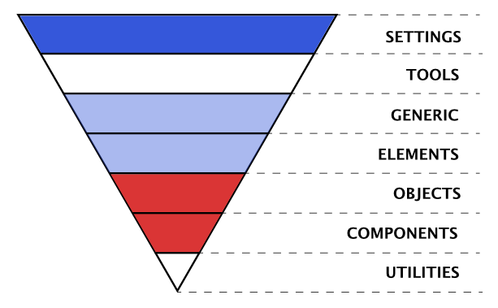
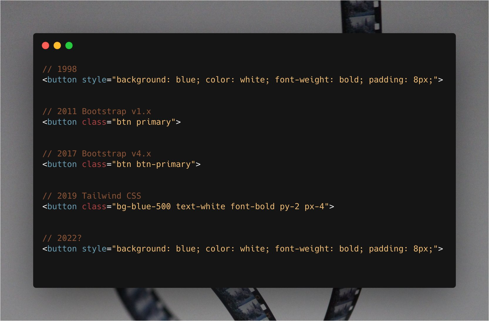

Over some years I have developed some observations that suggest a potential approach to using _CSS-the-good-bits_ in blissful harmony with CSS-in-JS for a reasonable and flexible styling solution. Most of this article looks at historical and modern contexts for attempts to "tame" CSS using a mental model to support the reasoning behind the [bit at the end](#enter-the-triangle-of-forces-).

## Contextualizing Current Suggestions

First I need to get this off my chest... I really like CSS 😲 (yes, I remember web development before CSS). I think it is an astoundingly simple language for what it does; and what it does, it mostly does in the best possible way:

1. It isn't blocking and is super optimized by browsers.
2. It provides the absolute simplest way to GPU accelerate any graphics. Ever.
3. It handles errors and unknown syntax gracefully.
4. It is declarative (caveats), simple and easy to understand (caveats) which mean it is low barrier to entry
5. It is elegant, efficient, flexible and powerful
6. It separates the concerns of style from structural markup (caveats!)
7. It gzips really nicely
8. It caches really nicely
9. It is really, really easy to make animations

...but

### ~~Large~~ Unplanned CSS can be UGLY! 👹

Wasteful. Confusing. There is plenty said about the shortfalls of CSS; "append only" giant stylesheets, 10 selector deep rules, CSS mirroring HTML structure...

Nevertheless largely speaking, all these problems arise from the following 3 things (in descending order of impact):

1. All style declarations are in the same, global scope - edit: with [layers](https://developer.mozilla.org/en-US/docs/Web/CSS/@layer), and to some extent [CSS variables](https://developer.mozilla.org/en-US/docs/Web/CSS/--*), CSS has become more modular.
2. Browsers don't always play by the same rules
3. Sometimes, the nuances of specificity can throw up some unexpected results. 🤔...

This first point is both a part of the genius of CSS and the foot-gun by which we make our lives hard. Basically CSS is inherently a no boundary language - it gives the tools to shape our own boundaries - which makes it easy to use but also makes it easy to create a mess **because there is no internal organizing factor**.

The second point can be tricky across all the different devices and OSes, nevertheless, these days there is better agreement amongst browsers, there is tooling (like PostCSS) to make catering for them easier... It is rare to be really caught by this anymore.

The third is actually very easy to work with; to put it bluntly, it is the language of CSS, and can be learned. Yes, Over time, and because starting is easy, it doesn't mean there won't be subtlety and interesting foibles.

## The Taming of the void

I think it is fair to say that most innovations in the CSS space have been attempts to address this first point and apply order to the boundary-less global scope. Before CSS-in-JS these could roughly be split into 2 camps:

1. Frameworks
2. Conventions

### Frameworks

Frameworks like bootstrap, tailwind, Atomic CSS, etc are typically quite a bit more than just CSS; they can range in scope to fully featured "component" libraries. In terms of how they treat CSS, they typically:

- Take the stance that if you are just applying their names and conventions, your CSS will be ordered and relatively small (caveats).
- Embrace the global nature of CSS, by providing one well thought out, structured way of applying CSS (basically a convention).
- Move the declarative nature of CSS to the HTML - accepting that people were not separating the concerns of markup and styling (which has its pros and cons).
- Work on the principle that you have as much access to the HTML as the CSS.
- Effectively solve the age old problem of naming.
- Are seriously battle tested (addressing point 2 of the CSS hard bits).
- Can abstract away some complexity by providing one approved way to apply CSS. This can make styles easier to reason about (point 3 above).
- Can leverage tooling by limiting options

Which is to say, frameworks create consistent boundaries and provide structure to write and think about CSS. This means they can solve a lot of the hard parts of working with CSS, but by adding boundaries they also introduce the costs of doing so. A couple of examples by way of demonstration are:

- Complexity: while they clarify how we should use CSS, CSS is huge and flexible, consequently they either have to be equally large and flexible or be much reduced. As a result complexity arises in one of two ways: Either they become complex themselves - e.g. their syntax becomes opaque, `<div class="Bgc(#0280ae.5) H(90px) D(ib)--sm W(25%)--sm"></div>` (from the Atomic CSS framework website). Alternatively they are too limited and mean that we also write CSS outside of their framework, which adds a new type of complexity.
- Unclear boundaries: ironically their clear rules can obscure other boundaries within their context - for me the most problematic thing with frameworks, albeit rather nuanced, is that they can engender a mental model where HTML and CSS are equally important - that it is okay to write HTML to fit the needs of the CSS classes that are needed rather than the need of the content. While not limited to frameworks, it is just something I see very often in codebases where frameworks have been used.

Clearly frameworks successfully achieve the ordering of the CSS environment, nevertheless there are also the costs to consider.

### Conventions

The other option, Conventions, are tantamount to a "Do It Yourself Framework". They can vary in their scope but they all represent organizing principles on top of CSS. BEM for example is a way of marking boundaries through naming, while OOCSS outlines an entire philosophy of structure. They are more simple than frameworks and come with less cruft, but on the other side of the coin, developers need to set everything up themselves and they lose out on the battle tested code and practices. Developers control the boundaries in their code.

Over time various Conventions have arisen, and I think that I've tried most of them at one time or another. I even had my own. For me, one Convention stands out from the others, because is arguably the Convention that most successfully achieves harmony with CSS and how it is used, ITCSS. It has a place for all of CSS without trying to change it, nevertheless providing mechanisms to avoid the pitfalls. It is quite easy to grasp, and promotes reuse and Separation of Concerns between presentation and content.

### What is IT(CSS) and why is it "good"?

[ITCSS](https://www.xfive.co/blog/itcss-scalable-maintainable-css-architecture/) <q cite="https://www.xfive.co/blog/itcss-scalable-maintainable-css-architecture/">stands for Inverted Triangle CSS and it helps you to organize your project CSS files in such a way that you can better deal with (not always easy-to-deal with) CSS specifics like global namespace, cascade and selectors specificity.</q>.

One of the key principles of ITCSS is that it distinguishes **7 types of CSS rule** and separates the CSS into these sections (called layers). What the layers are is a little academic once you understand the principle; they are ordered from most general (wide, top of the inverted triangle) to most specific (sharp, bottom of the triangle). Notably CSS now has formalised something like this with [CSS layers](https://developer.mozilla.org/en-US/docs/Web/CSS/@layer), and they work well with this paradigm.



The reason the layers work well is because they are boundaries that aren't at odds with **way we use CSS or the nature of CSS itself**. Consequently it feels as if there are no boundaries and natural to use. Furthermore, because of this, it isn't necessary to learn whole new syntaxes or frameworks.

Nevertheless, both the type of application we make and the tooling to make them are changing all the time. There are new ways of writing CSS and new ways of constructing web apps... so how does all this history apply to modern web development?

### Summary

"Frameworks" use and formalize one or more "Convention" into tooling and code structure. While "Conventions", allow developers to choose instead to do the part of that work that they need for themselves. Both types were successful because they helped in reasoning about styles in a project, with ITCSS, in my opinion, being the most successful (more on this below). Nowadays we have new ways of working and new tools, so how does this all apply to modern web development?

## CSS-in-JS, a new kind of foot gun? 🦶🔫

"CSS-in-JS" is a catch all term to describe a number of approaches to, what I think of as a natural evolution of atomic CSS that was driven by the forces of tooling (pre/post processing and bundling) and the move towards "componentising" UI such as React and Custom Components.

The different CSS-in-JS libraries deal with this new way of creating content for the web in their own ways, but they are all essentially new ways of solving the one problem - the lack of internal boundaries in CSS. They use modern tooling and application structures to "name-space"/boundary styles to a specific "atom", "molecule" or whatever of UI.

Some CSS purists would say that this is no different to name-spacing in BEM or one of the other Convention based approaches, but there are important differences:

- We have real modules in CSS
- Files can be optimized by tooling
- We have dynamic and conditional styles
- We have **an explicit relationship between "components" and their styles**, which means less of the "append only" stylesheets.
- It is easy and not nearly as bulky!

To put it another way, we get an explicit boundaries (modules) and a way to tie them to UI components so that styles across an application cannot clash.

Unfortunately it isn't all good news! Just as with previous attempts to "solve" CSS, this approach includes some sacrifices and some new costs:

- Loss of non-blocking, cacheable styles if JS is generating the CSS (or double loading CSS with Critical CSS)
- A great deal of duplication because all components exist in their own boundaries (caveats)
- On the fly CSS generation can be SLOW, especially in low end devices
- New syntaxes to learn for CSS devs
- Buy-in; once you start with one CSS-in-JS lib, it is hard to switch because of new syntax or coupling.
- Greater impact of mistakes. CSS is very forgiving of mistakes so errors in CSS files have low impact, but an error in a JS file can cause the application to error.

This whole discussion is nicely summed up by on twitter by @sanketsahu:


## Stepping back a bit

Hopefully I've explained why I don't think there has yet been a perfect CSS alternative developed; there are almost always as many issues with the solutions to the problems of CSS development as there are benefits... sometimes more.

Historically, each time one of these (imperfect) solutions has arisen and its problems have been realized, someone has stepped back and put in place some conventions and tools to mitigate them. These adapted workflows tend not to be as elegantly simple as using one tool, but are practical and focus on using the new tool for what it is good at and using other tools where they are needed to make the best of all worlds. It is worth being practical and recognizing that while a set of pliers is an excellent tool, there may be a better tool for getting a screw to go into some wood; and that maybe you will need more than one tool if you want to build a house...

In my opinion, the most successful solutions, like ITCSS, maintain the philosophical consistency and boundaries of each tool in the toolbox so that they are easy to use and think about, and have low cost boundaries.

## Solutions, choices and considerations

Having stepped back and evaluated CSS-in-JS in context, it is easier to make decisions about which tool/CSS-in-JS library is right for any particular circumstance and to notice some of the gaps in tooling that might make life easier.

### Which flavour? 🍦

The choice of CSS-in-JS will come with all its own boundaries and costs, and it should be evaluated for accordingly. One should consider the obvious pros and cons, but also pay attention to the boundaries and costs that the tools impose. Here is an example of looking at [CSS modules](https://github.com/css-modules/css-modules) for these considerations:

1. The development pattern is the same as CSS or SCSS, so there is a low barrier to onboard new devs. There is _some_ custom syntax (like `composes` and the scope syntax) and some best practices, but these are generally simplifications rather than complications.
2. The convention for CSS modules is to have a separate CSS file from the JS. The style classes are exposed as named exports from the module that can be imported into a JS file and used like `myStyles.coolStyle` or can be imported directly like, `import {coolStyle} from ./myStyles.module.css`. This means that CSS files can be worked on independantly while still maintaining the explicit CSS dependency relationship with the JS. One loses out on the convenience of the CSS actually being in the JS, but gains in simplicity and fault isolation.
3. Styles are scoped to the module, so there is no need to worry about naming clashes. This is a big win for fault isolation, refactoring and maintenance.
4. CSS modules are a standard, not a library, so there is no lock-in to a particular implementation.
5. CSS modules can be optimized by tooling. This can be good for performance, because the CSS can be optimized and bundled in the same way as JS, and can be loaded in a non-blocking way. However, the CSS is loaded as the JS modules is loaded, so there is a potential for the same CSS to be loaded multiple times, which can lead to unintended side effects, but also unnecessary page weight.
6. CSS modules' classes can be composed. This is provides a way to avoid code duplication, though it comes with a breakage of encapsulation.

This evaluation is concened not only the features of CSS modules, but also the boundaries and costs that they impose. I think that this is a good way to evaluate any tool, because it is the boundaries and costs that will determine how easy it is to use and how much it will cost to maintain.

## ITCSS it again

Given ITCSS's success in this area, there are lessons to learn from it and maybe some new observations for the new era.

A general observation, from years of working on websites is the 7 "layers" or types of CSS defined in ITCSS fall fairly neatly into 2 groups - **the styles that one always has to write for every project** (like layouts, themes, etc), and the **styles that are specific to implementation** (elements and context on each page). I've modified this diagram to reflect these:


### Styles that will always be used, for every project (in blue and white):

1. **Settings or Tokens** – may be used with preprocessors (like sass variables) and contain font, colors definitions, etc but no other type of style.
2. **Tools** – globally used mix-ins and functions. **Really only appropriate for preprocessors, frameworks, etc that have these concepts**
3. **Generic** – reset and/or normalize styles, etc. This is the first layer which generates actual styles.
4. **Elements** – styling for bare HTML tags (H1, A, etc.).
5. **Utilities** – utilities and helper classes with ability to **override anything in the triangle**, eg. a hide helper class

### Implementation specific (in red):

1. **Objects** – class-based selectors which define **undecorated design patterns**, for example media object known from OOCSS
2. **Components** – specific UI components. This is where the majority of our work takes place and our UI components are often composed of Objects and Components

Of all the style types considered useful by ITCSS, it is only the
2 red layers, that are typically the main focus of CSS-in-JS solutions. Though this is changing, vis [theme ui](https://theme-ui.com/), etc.

So, how do we cater for the more general styles that experience tells us most applications need?

## Theming

Some CSS-in-JS approaches have the concept of "themes". Themes are a set of shared styles that can be used throughout an application - the "Settings" layer in the figure above. The following are a couple of different approaches to this need; one CSS-in-JS solution and one based on the observations above.

### CSS-in-JS themes

Theming, as it is solved by
[styled-components](https://styled-components.com/docs/advanced#theming) looks something
like this (though likely 2 files):

```js
// Define our button, but with the use of props.theme
const Button = styled.button`
    font-size: 1em;
    margin: 1em;
    padding: 0.25em 1em;
    border-radius: 3px;

    /* Color the border and text with theme.main */
    color: ${(props) => props.theme.main};
    border: 2px solid ${(props) => props.theme.main};
`;

// Define the theme
const theme = {
    main: "mediumseagreen",
};

render(
    <div>
        <Button>Normal</Button>
        <ThemeProvider theme={theme}>
            <Button>Themed</Button>
        </ThemeProvider>
    </div>
);
```

Immediately you can see the value in the Styled-Components' approach: CSS syntax
in Components; awesomely, you can apply different themes by wrapping in
different `ThemeProvider`s; the themes are nice and declarative. However, observing the boundaries of the various parts of this, there are some area that should make us pause.

The CSS language is represented in the JS by that template string tagged on the end of `styled.button`. The styled-components solution for this boundary is quite nice because it is possible to quickly couple JSX with styles. What is more, one can use CSS syntax instead of JS Object notation. Nevertheless there is a context switch; each time we write CSS and use the theme, or add to the theme we are doing multiple language switches. While the CSS in the template string uses CSS syntax, the theme is JS object notation. So there is a cognitive switch within single lines of code where one is writing CSS, then switching to JS to insert a theme style and then back to CSS and then back to React... This is like changing lanes on the Motorway, while it seems easy, it belies the fact that most accidents happen during the lane change.

Testing becomes a little harder because of the provider; you can't use components directly in your tests because they will be outside the context that gives them the theme and likely throw an error.

Finally, it is worth talking briefly about points the type of costs of crossing boundaries that are moved, but not paid, by tooling/libraries. React makes it very easy to write HTML style "HTML" and "Componentize" UI, reactive rendering, etc. Tons of value, but the cost is a minimum bundle size (minified and gzipped) of > 30K. To put this into context [Addy Osmani](https://v8.dev/blog/cost-of-javascript-2019) recommends

> "Avoid having just a single large bundle; if a bundle exceeds ~50–100 kB,
> split it up into separate smaller bundles"

If you then add the extra [size of Styled-Components](https://github.com/styled-components/styled-components/issues/748) and the CSS that it has to turn into CSS...

The cost is transferred from the developer to the user (and the planet)... and that is only for the Settings layer. The irony is that **themeing is easier and less costly to do in plain old CSS**.

## Something of a conclusion

All which, if all else is equal, leads to one logical conclusion: leverage CSS for what CSS does well and CSS-in-JS for what it does well while protecting the fundamental philosophies and boundaries of each.

At its most fundamental, implement the boundaries around the 2 types of style highlighted in my modified ITCSS diagram. I rather pompously call this convention, "Triangle of Forces", because it represents 3 forces in balance, because it is heavily inspired by ITCSS's layers. It uses CSS-in-JS (or equivalent) and it uses CSS fundamentals with some conventions.

## Enter the Triangle of forces 🔻

On the face of it ToF is a split in the styles of an application or website, where there are some styles (if not values) that are relatively static and get used across multiple projects and some that are specific to an implementation. In the figure above, the stronger the colour the more changeable the layer, especially across projects.

The 5 ITCSS layers I highlight above as "Styles that always have to be set" tend to become almost static across projects once they have been setup for one project. The settings layer, gets set once per project and changes the values that all the other styles use. Largely speaking I consider all but 2 of these 5 layers to be optional, they are marked with blue. These styles should just be plain old CSS; output as normal CSS files and imported in such a way that they can be loaded as CSS and cached as CSS as close to root as possible.

### Settings/Design Tokens

The Settings layer is like the theme object in Styled-Components except that it is written in CSS and is therefore global - there are no ThemeProviders, no imports, no boundaries and no costs... This is safe because we are not declaring styles. This is the only place that this type of global CSS variable is declared in your application - a boundary by convention.

This is comprised of a structured list of CSS variables (custom properties). CSS variables are perfect for this use case because they are scoped, accessible to JS if necessary and respond to context e.g. media queries. Once set up the actual variables settle down to a consistent set that can be used in all projects with only the values changing.

I recommend using a using some consistent conventions:

1. Set up some variable prefixes that identify what the setting sets, e.g.
   `--t-body`; `--c-brand1`; `--s-3`; or you could be more explicit to avoid the
   issues of obtuse syntaxes, e.g. `--text-body`, `--color-brand1`,
   `--space-3x`.
2. Be as explicit as you can with what these are set to, to the point of making
   a named variable to set the token to, e.g. `--c-brand1: var(--bright-red);`.
3. Organize your tokens logically - e.g. put colours together, put typography
   together, etc
4. Have a token/setting for every theme part you need to set, e.g. some elements, like buttons will have multiple settings (border, background, etc) and then have hover, focus, etc states for each of those multiple settings too.
5. Only use design tokens in your code and only use the token logically. This means that one should not use a heading design token to describe text, even if the value is the one you want.

These conventions are to address the potential pitfalls of having opaque
variable names and the inherent problem of having a long list of things that
need to be remembered.

### Generic & Elements

Modern day browsers are much more consistent than they used to be, so reset
stylesheets are less "necessary", but there is still the need for a place to put
them. I tend to merge my Generic and Element layers for simplicity. This along
with the "settings" layer are the key areas where we can leverage CSS with a
light touch, without breaking the principles of the approach and simultaneously
overcome the limitations of CSS-in-JS.

We can use this layer to apply the "theme" set up in "Settings" on to **bare HTML elements**, e.g.

```css
  body, html {
    color: var(--c-body);
    font-size: var(--t-medium);
  }

  h2, .heading-l {
    font-size: var(--t-large);
    line-height:...
  }
```
**NOTE: this is the only place in your styles that you should reference bare HTML elements**, otherwise you enter back into the world of unreasonable CSS.

Lastly a quick word about Utility classes.

### Utilities (optional)

These are useful classes that one uses a lot, such as `.screenReaderOnly`.
Ideally there are not too many of these because, by their nature they need to be
rule breakers; they need to override other styles. It makes sense for this to be something one can compse with something like the CSS module `composes` rule, or just plain CSS classes. One could even use an entire CSS utility library here if one wanted...

### What that looks like

"Settings" and "Elements" files might look something like this:

```css
/* setting.css - in reality this might be several files for each of the types of variable */
:root {
    /***** Primary Palette *****/
    --c-m-blue: #2b70b9;
    --c-d-blue: #{$cobalt}; // using sass variables as "static"
    --c-black: #{$black};
    --c-white: #ffffff;
    --c-orange: #ffbd4a;
    // ...etc

    /***** Grayscale Palette *****/
    --c-gray-100: #f5f5f5;
    --c-gray-200: #eaeaea;
    // ...etc

    /***** Usage Semantics *****/
    --c-focus-ring: var(--c-orange);
    /* Body */
    --c-body-bg: var(--c-white);
    --c-body: var(--c-black);
    --c-main-bg: var(--c-gray-100);

    /* Button - there is nothing stoping these values being set and stored with a button component, but we should be aware of other components that might want to use them */
    --c-button: var(--c-white-pure);
    --c-button-bg: var(--c-m-blue);
    --c-button-border: var(--c-white-pure);
    --c-button-active: var(--c-m-blue);
    --c-button-bg-active: var(--c-white);
    --c-button-border-active: var(--c-m-blue);
    /* ...etc */

    /* Link */
    /* ...etc */

    /****** TEXT *******/
    --t-base: 16;
    --t-sm: calc(
        14rem / var(--t-base)
    );
    --t-m: calc(16rem / var(--t-base));
    --t-l: calc(18rem / var(--t-base));
    /* ...etc */

    --t-body: var(--t-med);
    /* ...etc */
}

/* css variables can be modified by context like media queries */
@media (min-width: $bp-s) {
    :root {
        --t-sm: calc(16rem / var(--t-base));
        --t-m: calc(18rem / var(--t-base));
        --t-l: calc(20rem / var(--t-base));
    }
}
/* ...etc */
```

You would use these theme members initially in the "Elements" CSS file to construct a general theme that sets up consistent regular rules, and you
would also use them in your Components.

```css
/* elements.css */
body {
    background-color: var(--c-body-bg);
    color: var(--c-body);
}

/* This will style all buttons which you may or may not wish, or you could create a local theme */
button {
    color: var(--c-button);
    border-color: var(--c-button-border);
    background-color: var(--c-button-bg);
    border-width: var(--button-border-width);
    border-style: var(--button-border-style);
}

button:focus,
button:hover {
    color: var(--c-button-active);
    border-color: var(--c-button-border-active);
    background-color: var(--c-button-bg-active);
}
```

```js
render(
    <div>
        <button>Themed</button>
    </div>
);
```

Notice the `:root {}` pseudo-class, it matches the `<html>` element, so all
variables declared in there are scoped to the html tag and its descendants - i.e. globally.

Whether the above looks like a good solution or not, let's examine it by
using the same criteria by which we looked at the other solutions:

The CSS theme setup is its own concern and does not need to be a conern of the JS until it needs to be changed. When we want to change it, the use of the lowest possible level specificity also lowers the cost of the change - the values are setup to be have *scoped* changes.

One thing about this separation of concerns is that the files that contain one set of concerns is quite separate from the other concerns, which can be a good or bad thing, but at the very minimum, we don't have side effects like testing becoming affected. Equally, there is no cost hidden by tooling to this solution, what we make is directly delivered to the user with no extras.

That said, we still have a **globally scoped CSS** footgun, albeit mindfully used and controlled by convention.

In this figurative world where all other concerns are equal, by harmonising with the nature of CSS, the TOF solution can be a considerably simpler solution, with fewer costs, hidden or otherwise. This is not a reflection on the excellent CSS-in-JS libraries out there, but rather an indication of the complexity of the problem.

## Localized themes

One final note about this approach is that it works really well for component libraries (see the excellent [Shoelace library](https://shoelace.style/)) and componentised UI. We can create locally scoped themes in harmony both with CSS and with a boundaried, component based application. The CSS variables we saw above were all scoped to the `:root` element, but actually you can scope them to any CSS selector and over-write them at that selector too and it will be scoped only to that usage. In this way you can make any number of themes for different boundaries in your application.

```css
.myComponent {
    --color: green;
    --background: black;
    --spacing: 0 var(--s-1);/* notice this is using one of the design tokens from the main settings */
}

/* now any child of myCompnent can use those theme variables */
.childOfMyComponent {
    --background: #333;

    color: var(--color);
    background: var(--background);/* comes out as #333 */
    margin: var(--spacing);
}
```

## Summary

There have been many ways of approaching styling on the web and I think it is
fair to say that they all have their good points and often just as many bad points. This is as true of modern CSS-in-JS approaches as of "Good 'ole CSS". In my estimation, the best solutions work with CSS, rather than cut across. We need accept tooling like using pliers to hammer  in a screw, we can choose the right tools for each situation. The solution presented here is not the only working solution; the important thing is that we understand the boundaries that our decision impose upon us and the costs that we will pay for them.

## Further reading

<https://www.xfive.co/blog/itcss-scalable-maintainable-css-architecture/>
<https://medium.com/dailyjs/what-is-actually-css-in-js-f2f529a2757>
<https://gist.github.com/threepointone/731b0c47e78d8350ae4e105c1a83867d>
<https://medium.com/free-code-camp/the-tradeoffs-of-css-in-js-bee5cf926fdb>
<https://mxb.dev/blog/the-css-mindset/> <https://mxstbr.com/thoughts/css-in-js>
<https://css-tricks.com/bridging-the-gap-between-css-and-javascript-css-in-js/>
<https://css-tricks.com/bridging-the-gap-between-css-and-javascript-css-modules-postcss-and-the-future-of-css/>
<https://css-tricks.com/css-modules-part-1-need/>
<https://jxnblk.com/blog/two-steps-forward/>
<https://css-tricks.com/breaking-css-custom-properties-out-of-root-might-be-a-good-idea/>
