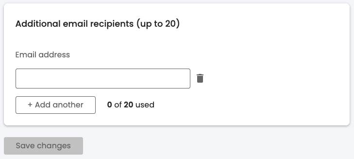
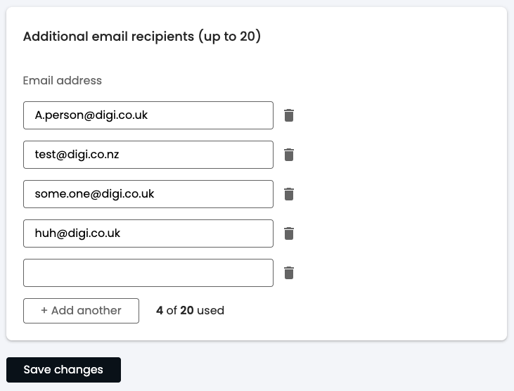
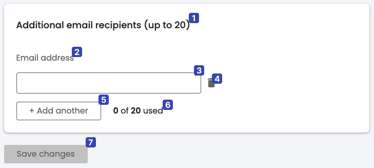
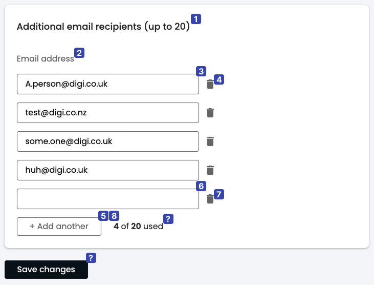
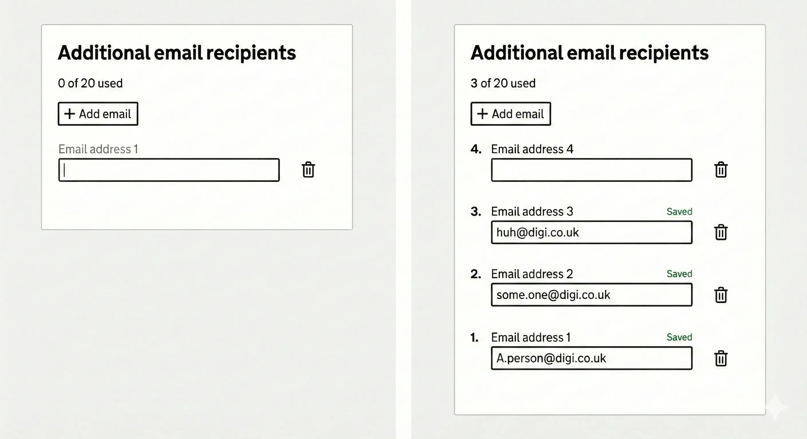

## Introduction

This is the first article in a series that looks at common design patterns and how to make them accessible. This article covers the following topics:

- The "add another" pattern
- How to think about the design from the perspective of users with varying abilities
- The accessibility considerations that become apparent when using this way of thinking
- How to address these concerns

## What is this "add another" pattern?

The "add another" pattern is a common pattern, often used in forms, to allow users to add, edit and delete additional fields or items. It is often used in situations where the number of fields or items is not known in advance, such as when creating a list of items or when adding additional contact information.

The following is the "design" for this pattern. It is meant to be typical of the type, rather than exhaustive. It doesn't include all the usual requirements for interaction (a common lack), so we will address those as well. There are 2 design states, the initial state and a filled in state.

## Patterns of thought - thinking accessibility

Before we dive into the ways of thinking, remember the maxim, "Nothing about us without us". Which is to say that these are not a replacement for real users, with real challenges, feedback, but rather a set of guidelines to help you think about accessibility in your designs.

### 1. Logical order

The first, most fundamental way to review designs is to consider is how the content reads linearly - this is an [explicit requirement to meet WCAG Level A](https://www.w3.org/WAI/WCAG22/quickref/?versions=2.2#meaningful-sequence), and it covers the general heading of "Understandable" (from the POUR acronym) and the "Info and Relationships" WCAG criterion, because a linear, logical order helps users of screen readers, keyboard users, screen magnifiers, and users with cognitive challenges to understand and navigate the content. Users with screen readers will hear the content in the order it is presented on the page and may not have the context afforded sighted users about what surrounds each element, and screen magnifiers may not be able to show all elements at once, so it is important to arrange content in a logical order **that provides all the context needed to understand each element**.

This is what the unfilled state looks like with this lens (the order is added next to each element):

At first glance, the initial state seems fine - the order progresses from the group title (1), which gives us context and a limit on the number of items that can be added; then there is what looks like a label (2) for the input, "Email address", followed by the input field itself (3); then there is a "bin" icon (4), followed by the "Add another" button (5). At this point, there is some status text (6), "0 of 20 used", finally a "Save" button (7).

Note, that the status text (6) gives context to the "Add another" button (5) (or arguably the whole group), however it follows the button and the rest of the elements it gives context to. For users who cannot perceive the status text by the time they have used the form and hit the button, this could be a problem.

Equally, the save button (7) provides the user with a sense of safety and control. However, if we think about it, there is no indication that things are not saved when adding emails, apart from a disabled save button which enables once the user has made changes... Which means that there are 2 critical points in the user's journey where they may fail:

1. The user who is following the linear flow has no awareness of the existence or state of this button.
2. All users may not realise that they need to save and may leave the form unsaved and lose their work.

Furthermore, there is also the question of when the status text (6), should change - should it increment when a new field is added - even though the user has not added an email yet, so not used their allotment? Or, only when the new field is validated - in which case, how do we communicate the addition of the field and the point at which it is "used"? Or only when the form is saved? This pattern could be confusing to users who are not familiar with this particular form.

The story gets more complicated once we start filling the form in:

Once the user clicks the "Add another" button (currently position 5), the order changes because a new input field and bin icon is added at the end of the list, above the button the user just clicked. Where should we put the focus when the new field is added? If we leave it on the button, then how do we communicate to the screen reader user that they need to navigate backwards, past the new bin button, to the new input field? If we put it on the new input field, is there enough context for the user to understand what has happened, and where they are now in the form? Equally, depending on when the status is incrementing, should it be reading out now?

As you can see, this design pattern comes with a surprising number of complexities once we start examining it by this lens. Fundamentally, it breaks this linear flow of elements.

### 2. Name the things

My secondary method is to try to "name" each element or group in the design. The name should ideally be **independent of context** or have all the context proximally situated. This technique is especially useful for elements users need to interact with. If I find myself questioning what something is, or it needs more context, that is a sign that something is needed in the design or implementation. This practice helps ensure both that the design is intuitive to our users, which, for example, means that voice control users can easily use our UI. It has the knock on effect of ensuring a relatable "language" between the various stakeholders, thereby reducing friction in things like design handovers and, indeed, customer support .

My attempt to name the elements of the design, looks like this - notice that the numbers also correspond to the things I want to name:

1. Card title - Behaves as a description of the contents of the card.
2. Group title ("Email address") - this should be describing the purpose of the following, grouped inputs.
3. 1st email address field? This ordinality relies on us already having context of where we are in the list, so this is failing as a title. What else could be added to clarify this for users who don't have context for the whole list?
4. Delete 1st email address button? This suggests that there is a grouping of email address field and its delete button - a "email management" group.
5. "Add another" button.
6. Email field usage count.
7. Save button.

As you can see, there is some confusion about the place and purpose of some elements. Equally, some elements, like the "delete 1st email address" button, rely heavily on context to be understood. This gives us clues about how we can improve the design to be more generally intuitive and useable. Furthermore, we might start to notice some tensions between various people's needs, e.g.
[Label in name](https://www.w3.org/WAI/WCAG22/Understanding/label-in-name) requirement, that helps Voice control users to easily interact with items and [providing textual identification of items that otherwise rely only on sensory information to be understood](https://www.w3.org/WAI/WCAG22/Techniques/general/G96) which helps users with visual impairments to gain context that would otherwise be lost.

### 3. Utility, redundancy and clarity

My final methodology acknowledges the fact that, while Assistive Technologies (ATs) are good tools, the experience for users with disabilities can still be much more challenging than it should be. Consequently, the aim is to reduce friction and improve clarity. This method should be the foundation for further conversation about design improvements as well as the semantics of the final implementation (HTML should express structural meaning). It is, quite simply, asking each of the following questions for each element:

1. What would need to change if we removed it? This indicates utility.
2. How can this better serve its purpose? This indicates clarity.
3. What else performs this function? This indicates redundancy.

Sometimes it is not as simple as a yes or no, so don't forget to ask all 3 questions. I came up with the following for the numbered elements:

1. The title is cannot be removed and no other element can replace it (1, 3), but it is actually 2 things: a title and an instruction of the number of email addresses one can use (2). Equally, the instruction is repeated by the status message (3).
2. The group title is important from the point of view of relationships, it extends the title's meaning (1,3), but it needs to be more descriptive of what the group is (2). Perhaps we could remove this altogether and use the title as the group name (3).
3. The actual form fields are fundamental (1), but they have no visible labels so they are hard to understand without visual cues (2). The form would not work without these (3).
4. The delete buttons are equally important (1), but, again, have no visible labels, so they rely on visual cues (2). The delete buttons provide distinct functionality (3).
5. The "Add another" button is important and distinct (1, 3), and is understandable - within the group context (2). It would be possible to just provide 20 email fields, but especially if there is a "Save" button, this could make it arduous to use and harder to grasp quickly (1).
6. The form status message helps the user understand the current state of the form as well as instructions; while the title currently has some of this information (3), there is no other way to announce additions to the form (1). Nevertheless, its placement near the end of the form interferes with its utility (2). If all the email groups were numbered, this would be less necessary (1,3), however, we still need a way to announce additions to the form.
7. The "Save" button, as mentioned above, does give users a sense of safety (1), but its requirement also could lead to users losing their work (2). I would suggest that this button is not required because the user can always edit and delete their work, so auto saving, with a per field indication, is a better option (1).

## Synthesising the findings

Applying these three lenses reveals several tensions that are common in accessibility work:

- **Verbosity vs. visual cleanliness**: Adding visible labels and numbering improves clarity for AT users but may feel cluttered to sighted users. The goal is to find a balance that serves everyone.
- **Implicit vs. explicit state**: The original design relies heavily on spatial relationships and visual cues that don't translate well to non-visual contexts.
- **User control vs. cognitive load**: The "Save" button gives users a sense of control, but introduces the risk of lost work and adds to the mental model users must maintain.

These tensions don't have perfect solutions - they require thoughtful design decisions that prioritise the needs of the broadest range of users.

## Redesigning the form

Using these ways of thinking, we will invariably come up with questions and discussion points that should first be addressed in the design and UX considerations, before trying to implement it (though there will be some suggestions of semantics and UX details for different ATs that will arise).

### Changes to be made

If we compile the considerations from above, it comes down to the following recommendations:

1. Simplify the title to "Additional email recipients".
2. Use the title as the grouping heading and remove the confusing "email address".
3. Move the status message to a more prominent location near the beginning of the form. Use `aria-live="polite"` or `role="status"` to ensure changes are announced to screen reader users.
4. Move the "Add email" button to the top of the form, after the status message.
5. Add numbering, in reverse order, to email groups to simplify the context of the input fields and delete buttons. The "Add email" button should add a new email group at the top of the form.
6. Focus management must be considered; when a new email field is added, move focus to that field programmatically. Provide sufficient context via accessible name (e.g., "Email 1 of 3") so users understand their position without needing to explore the surrounding content.
7. Remove the "Save" button and implement auto-saving with per field indications. *Note: auto-saving requires careful implementation - consider network failure states, providing clear saving/saved indicators, and potentially an undo mechanism to maintain user confidence.*
8. Consider adding visual labels to the input fields and bin icons.
9. Error handling is a subject all by itself. In the most simple terms, validation errors should be associated with their respective fields, e.g. `aria-describedby`, and the error state should be conveyed via `aria-invalid`. Consider how errors are announced - should focus move to the first error, or should a summary be provided?

## The redesign

### How the redesign addresses the issues

In this new version of the design, we've removed repetition and redundancy by using the title as the group description, moving the form status to the top, and removing the save button. Removing the save button introduces questions of safety for the user, but we've added clear indications that their input has been saved - this is tied in with the updating of the form status, triggered when the user's focus leaves the field and the field contains a valid email.

Reversing the order of the inputs reduces the amount of movement the user is forced to make in order to complete the fundamental task of the form, while adding numbers next to input groups gives a lot of context, both to screen readers (via semantic markup) and visually. We have also added real labels that echo this numbering and give pointers for Voice Control users as to the "name" of the bin button (e.g. "Delete email address 1") - this was a compromise between visual clutter and explicit, clear labelling - see more on this in the [voice control article](./at-voice-control.md).

The choice of putting the "Add another" button right at the top of the field group ties in with the reversal of field order, but also gives the user all the knowledge they need to understand the addition of a field and where their focus has been moved. Getting back to the button requires just one backward movement, making the interaction predictable and efficient.

## Further reading

- [WCAG 2.2 Understanding Documents](https://www.w3.org/WAI/WCAG22/Understanding/) - detailed explanations of all success criteria
- [ARIA Authoring Practices Guide](https://www.w3.org/WAI/ARIA/apg/) - patterns and guidance for accessible widgets
- [Gov.UK Design System: general advice on clear UI patterns](https://design-system.service.gov.uk/get-started/)
- Heydon Pickering's [Inclusive Components](https://inclusive-components.design/) - practical patterns for accessible UI components
- [Inclusive Design Principles](https://inclusivedesignprinciples.info/)
- [WebAIM Screen Reader User Survey](https://webaim.org/projects/screenreadersurvey10/) - research on how AT users actually navigate the web
- [My article on braille displays](./at-braille-displays.md)
- [My article on eye trackers](./at-eye-trackers.md)
- [My article on keyboard navigation](./at-keyboard-navigation.md)
- [My article on screen readers](./at-screen-readers.md)
- [My article on screen magnifiers](./at-screen-magnifiers.md)
- [My article on switch access](./at-switch-access.md)
- [My article on voice control](./at-voice-control.md)
