## Introduction

We're living in an era where Large Language Models (LLMs) have become integral to software development. For many developers, AI coding assistants are no longer just helpful tools—they're primary collaborators in the code we ship to production. With this shift comes a critical question: when we accept AI-generated code with a quick "yes," what accessibility standards are we actually committing to our users?

This article examines how well three leading AI coding tools — V0 by Vercel, Claude, and Google AI Studio — handle accessibility requirements when building user interfaces. While much has been written about AI's technical capabilities and limitations, far less attention has been paid to how these tools serve users with disabilities and the assistive technologies they rely on.

The results, as you'll see, reveal both surprising successes and concerning gaps in LLM coverage of inclusive design. More importantly, this analysis offers concrete insights for developers who want to ensure their AI-assisted code meets accessibility standards — and for the AI companies building these tools.

## Understanding Web Accessibility

At the risk of stating the obvious, Web accessibility ensures that websites and applications are usable by everyone, including people with disabilities. The Web Content Accessibility Guidelines (WCAG) organize accessibility into four key principles, known by the acronym **POUR**:

- **Perceivable**: Information must be presentable in ways users can perceive (e.g. alt text for images, sufficient color contrast)
- **Operable**: Interface components must be operable by all users (e.g., keyboard navigation, reasonable time limits)
- **Understandable**: Information and UI operation must be understandable (e.g. clear language, predictable functionality)
- **Robust**: Content must be robust enough for interpretation by assistive technologies (e.g. semantic HTML, ARIA attributes)

### The Role of Assistive Technology

It is useful to understand that people with disabilities use various assistive technologies (AT) to interact with digital content, so, understanding the ATs and their usage helps us understand the experience we are creating:

- **Screen readers** convert text to speech or braille for users with visual impairments
- **Voice control software** allows navigation and input through voice commands
- **Keyboard navigation** serves users who cannot use a mouse due to motor impairments
- **Screen magnification** helps users with low vision
- **Braille displays** provide tactile feedback for users who are blind or have low vision
- **Switch access** enables interaction using switches, joysticks, or other input devices

The good news is that the fundamental key to accessibility simply stems from using semantic HTML. Later, thoughtfully using ARIA (Accessible Rich Internet Applications) attributes — not as a replacement for semantic markup, but as an enhancement when semantic HTML falls short.

## Research Methodology

To evaluate how well AI coding tools handle accessibility requirements, I designed a controlled experiment with consistent parameters across all platforms.

### Testing Protocol

1. **Consistent Input**: Used identical design mock-ups and prompts across all tools
2. **Standardized Environment**: Bootstrapped equivalent application structures where needed
3. **Comprehensive Accessibility Testing** using multiple tools and techniques:
   - **[WAVE browser extension](https://wave.webaim.org/)** for automated accessibility scanning
   - **[Polypane](https://polypane.app/)** for visual debugging, accessibility reports, and simulation testing
   - **Accessibility Object Model (AOM)** inspection to understand how browsers represent content to assistive technologies
   - **macOS VoiceOver** for screen reader testing (while NVDA and JAWS are more common, using any available screen reader in your development workflow is valuable)
   - **macOS Voice Control** for voice command functionality testing
4. **Analysis and Iteration**: Documented findings and attempted to prompt tools toward more accessible solutions
5. **Best Practices Documentation**: Compiled recommendations for developers and AI tool creators

### The Test Case: Dynamic Email Recipients Form

I chose to test a dynamic email recipients form — a common UI pattern that presents several accessibility challenges. Dynamic forms require careful handling of focus management, labeling, error states, and screen reader announcements — all critical accessibility considerations that separate good from poor implementations. The following designs are not uncommon, and to be quite frank, I would probably want to address some of the issues directly with the design, rather than work around them with markup, nevertheless, this is a real-world example, so I thought it would be a good test case.


### The AI Tools Under Review

I selected three prominent AI coding tools that support design-to-code workflows:

**[V0 by Vercel](https://v0.dev/)**: A specialized web-based tool trained specifically for rapid UI development. Built on the Vercel platform with strong bias toward ShadCN UI components, V0 represents the "AI native" approach to frontend development.

**[Claude code](https://docs.anthropic.com/en/docs/claude-code/overview)**: Anthropic's powerful coding assistant that runs in a terminal environment. Using the latest Claude model, it can analyze entire codebases and generate multi-file solutions with sophisticated reasoning capabilities.

**[Google AI Studio](https://aistudio.google.com/welcome)**: Google DeepMind's web-based development environment that provides access to their latest language models for code generation and analysis.

### The Challenge Prompt

```markdown
Create a React TypeScript component based on the attached design images. This is a dynamic email recipients form with the following requirements:

FUNCTIONALITY:

- Allow users to add up to 20 email addresses
- Each email field should have a delete button (trash icon)
- Show usage counter "X of 20 used"
- "Add another" button to create new email fields
- "Save changes" button that's disabled until changes are made
- Form validation for email format

TECHNICAL REQUIREMENTS:

- Use React 18+ with TypeScript
- Implement proper state management
- Include form validation
- Ensure responsive design

Please provide complete, production-ready code with accessibility best practices implemented from the start.
```

**Note**: The prompt explicitly requested accessibility best practices.

## Initial Results

None of the tools produced pixel-perfect implementations of the design, but each resulted in an ostensibly working solution.

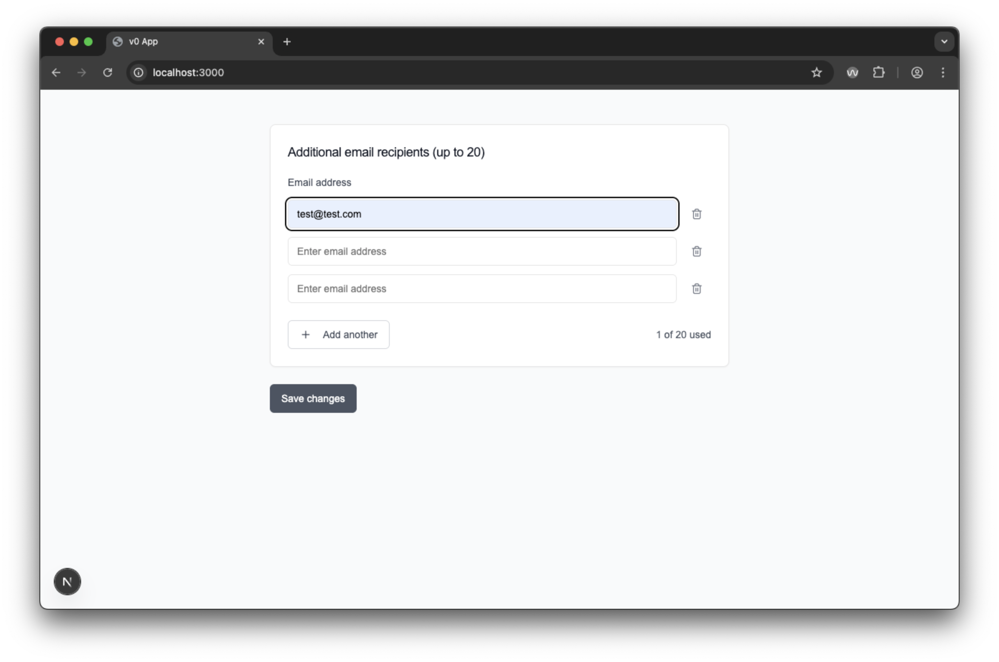
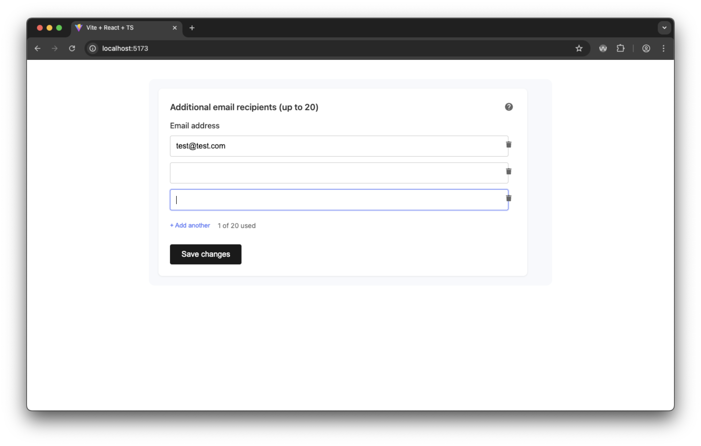
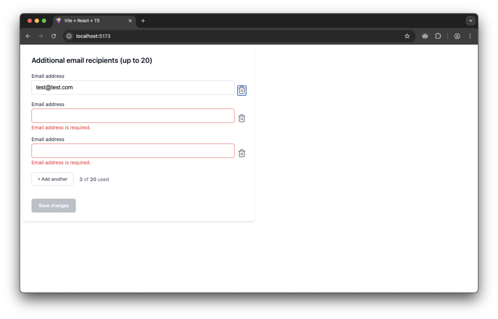

_Visual comparison of initial outputs: V0 (top), Claude (middle), Google AI Studio (bottom)_

While visual fidelity varied, the more important question was how each handled the accessibility requirements of dynamic form management, focus control, and assistive technology compatibility.

## V0 by Vercel: The Component Library Approach

V0 delivered a polished-looking interface that leveraged ShadCN UI components — a choice that brought benefits for accessibility, and shows the power of using a good tool.

### First Impressions and Setup

The V0 web interface made it easy to get started quickly, though the initial output contained a simple import error that prevented the code from running. After pointing out the issue, V0 quickly corrected it and produced a functional form.

V0 generated a complete Next.js project with sophisticated tooling and dependencies (455.5 MB across 4,131 files), representing the most heavy development environment of the three tools.

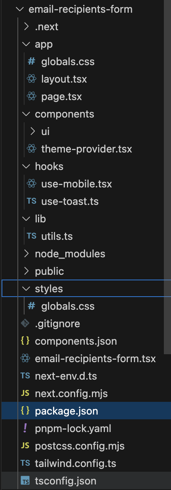
Reasonable project structure

### V0 Visual Design and User Experience

V0's output was visually appealing and responsive, though it suffered from some color contrast issues. The interface behaviour had some unexpected quirks:

- Usage counter increments when a valid email is entered, but doesn't decrement when an email becomes invalid through editing
- Delete buttons are disabled until you have at least 2 items (not a stated requirement, but arguably reasonable UX)
- Real-time validation provides immediate feedback as users type, but immediately errors the email field until the user finishes typing. This is the standard HTML5 behaviour, but it is bad UX and can be confusing and alarming for users.

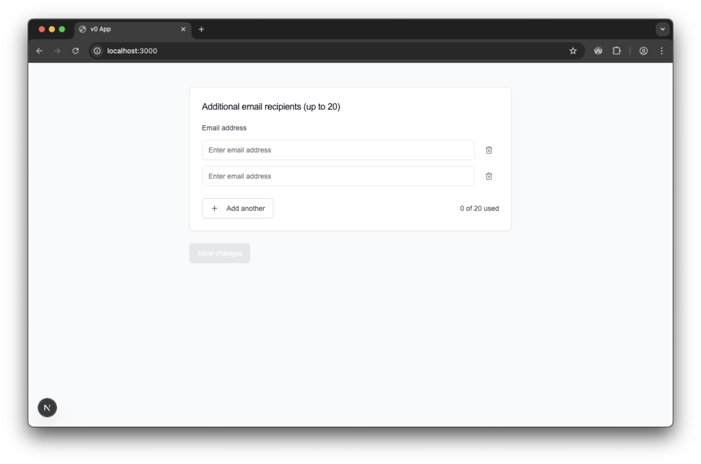
V0 looks good, but there are some oddities in the user experience.
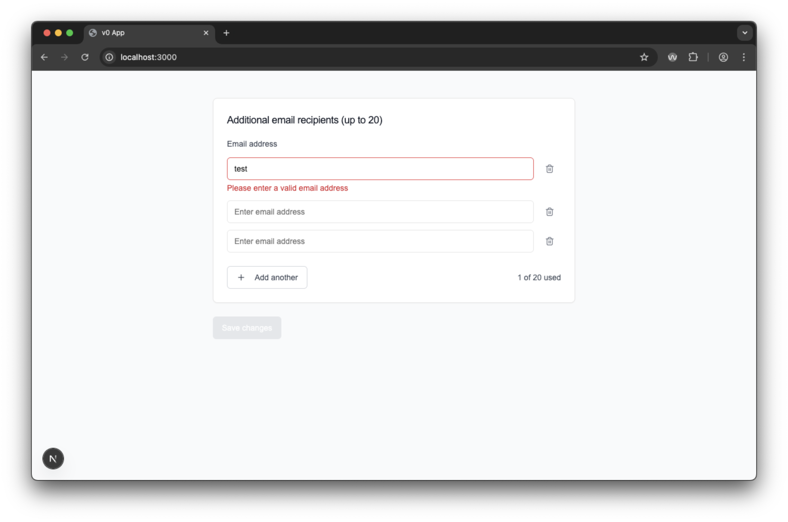
V0 sets the field to invalid on user input, which can be confusing and alarming for users, interrupting their workflow and potentially leading to frustration.
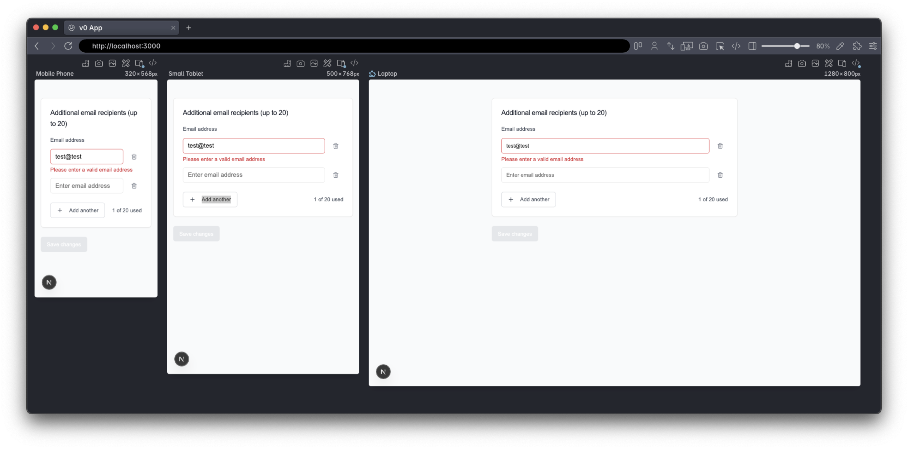
V0 effortlessly adapts to different screen sizes, ensuring a consistent user experience across devices.

#### V0 HTML Structure Analysis

Largely, I was not impressed by the semantics or the amount of "thought" that went into the markup in this app - the part handled by Shadcn UI is fine, but the AI generated HTML makes heavy use of generic `div` elements rather than semantic markup. For example, the main heading is a `div` rather than proper heading markup. Equally, as we'll see with the other apps, only the first email input has a label - the other inputs rely solely on the placeholder text. Additionally, one of the worst problems was the incorrect button labels - the delete buttons reference the email inputs with an ordinal, e.g. "delete email address 1", when actually the first input is labelled "Email address" because of the label element.

```html
<!-- Excerpt showing problematic structure -->
<div class="tracking-tight text-lg font-medium text-gray-900">
  Additional email recipients (up to 20)
  <!-- Should be <h2> -->
</div>

<label for="email-0">Email address</label>
<!-- Only first input labelled -->
<input id="email-1" placeholder="Enter email address" />
<!-- No label! -->

<button aria-label="Remove email address 1">
  <!-- Inconsistent numbering -->
  <span
    >1<!-- -->
    of 20 used</span
  >
  <!-- Fragmented text -->
</button>
```

#### V0 Screen Reader Experience: Navigation Challenges

Testing with VoiceOver, the form elements provided by Shadcn UI worked well, but, as mentioned above, the labelling on the delete buttons was a bit confusing. This is made worse by the fact that the delete button is skipped when there is only one field, so one doesn't know that there is a structural pattern (of field + delete button) - this lack of consistency significantly impairs a user's capacity to "Understand" the application. Nevertheless, there was a real blocking issue that made it nearly impossible to use without sight - adding new fields doesn't announce that something has changed for screen readers. This is compounded by, the focus remaining on the "Add another" button, below the new field, so there is no way for visually impaired users to know what has happened, or find the new field. Especially as there may now be an unexpected delete button as the first thing they come across, navigating backwards.

**The Good:**

- Proper error messaging with `role="alert"` and `aria-describedby`
- Good focus indicators for keyboard navigation
- Email validation provides immediate feedback (albeit in a problematic way)
- V0 incremented the summary of used fields only when a valid email address was added, which is good in that it would only treat valid email addresses towards the total, but it did not announce the change to the user. Nor did it decrement the summary if one subsequently changed an email address to be invalid.

**The Problematic:**

- Main heading announced as text, not a heading
- Delete buttons are skipped during normal navigation flow (because they are disabled until there are 2 or more items)
- Adding new fields creates unlabelled inputs
- Usage counter fragmented: announces "1", then separately "of 20 used"
- No announcement when new fields are added, leaving sight impaired users unable to locate the new, unlabelled fields
- Fields are not grouped together for better accessibility (navigability, and improved screen reader experience)

**The Result:** Screen reader users become stuck after adding an additional email address, unable to find the new, unlabelled fields and may not know that they can delete fields due to the buttons being disabled until there are 2 or more items.

#### V0 Voice Control: Functional But Flawed

Voice Control users could technically navigate the form using numbered element selection, but the experience was suboptimal due to unclear delete button labeling and the lack of visible labels on dynamically added fields.

#### V0 Accessibility Testing Results

Running the tools highlighted many of the same issues, plus one or two more.

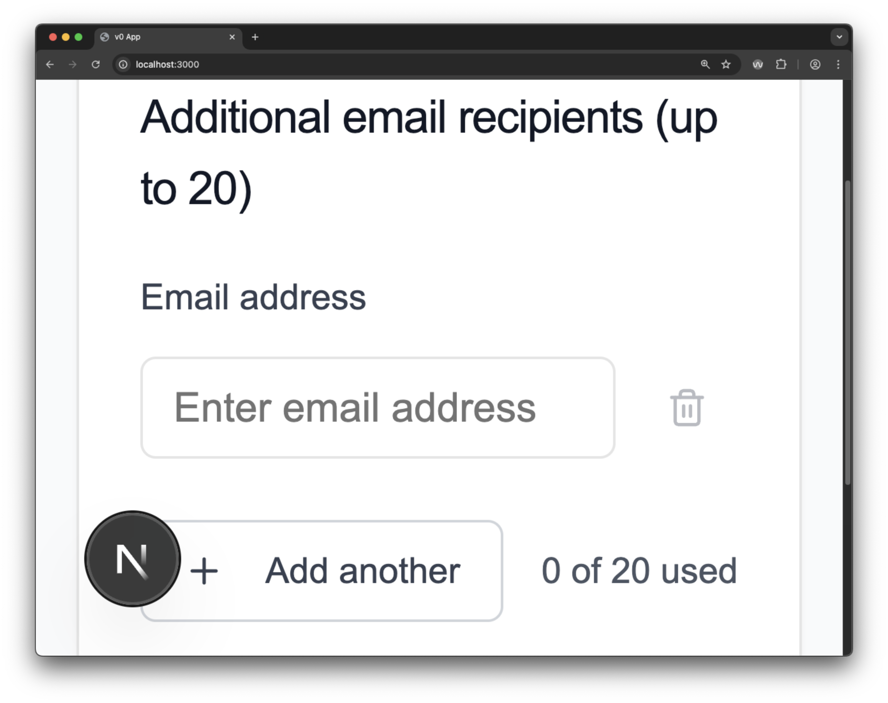
V0 handles the 400% zoom well.
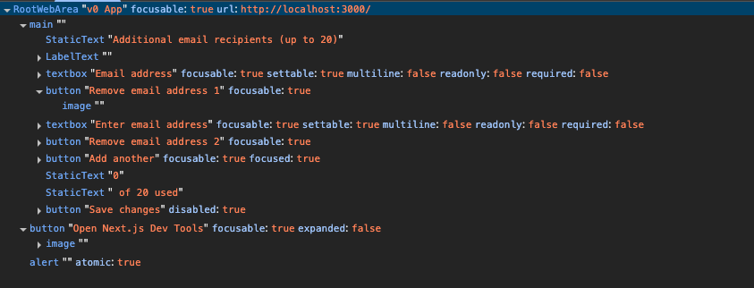
The Accessibility Object Model (AOM) view in devtools also shows the lack of information in the markup, along with the confusing delete button labeling.
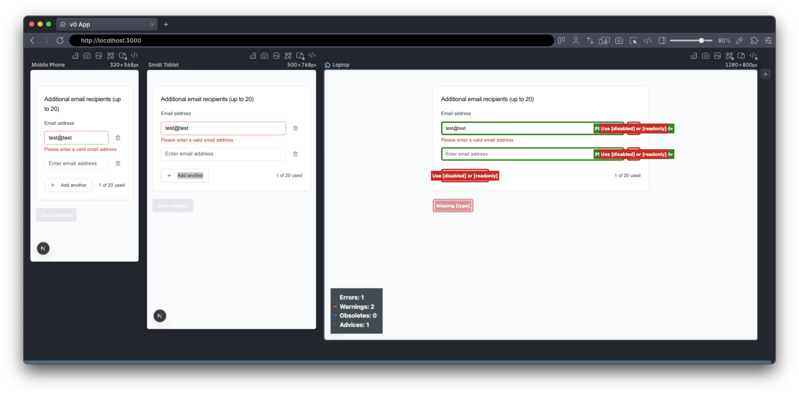
Polypane's accessibility CSS highlights the some issues on the buttons (but fails to identify the missing input labels and the other UX issues).
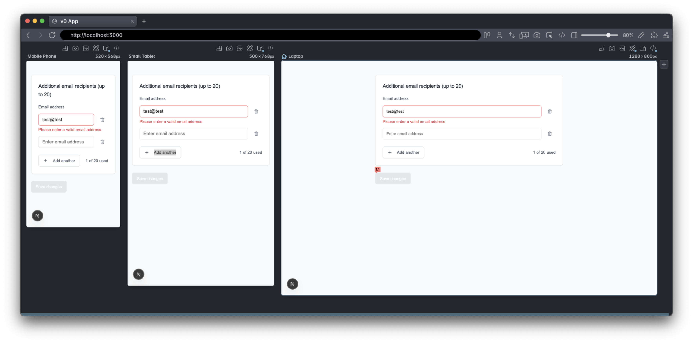
Polypane's contrast checker highlights the contrast ratio problems with disabled button state.
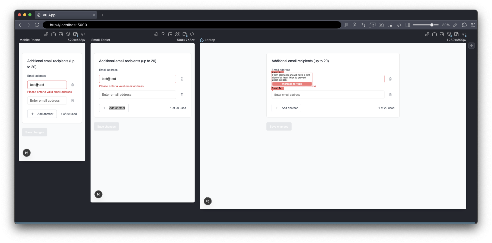
Polypane's small text checker shows a few small text issues as well..
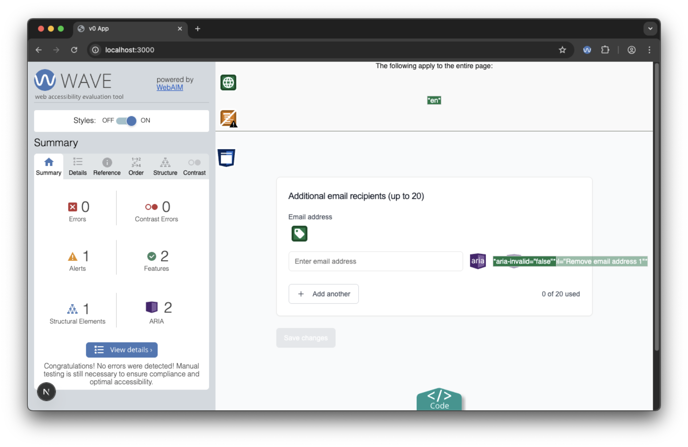
The WAVE extension shows no notable issues where there is only one input, notably it doesn't raise the contrast ratio issues for the disabled button state.
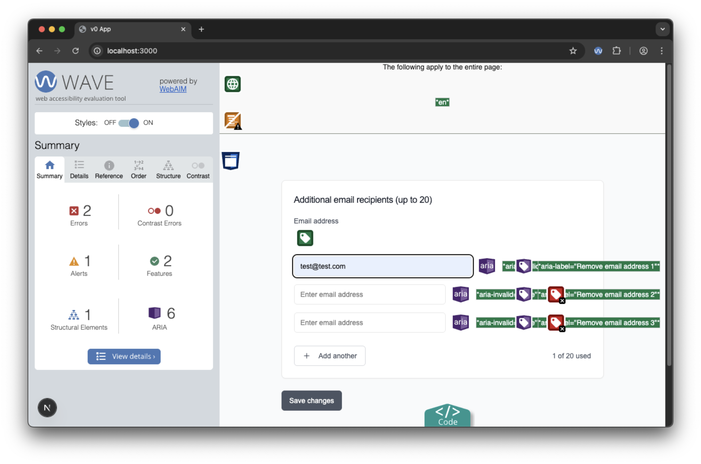
The WAVE extension does show an error for the missing input labels where there is more than one input.

As you can see, the automated testing tools identified several issues with the accessibility of the form, including missing input labels, contrast ratio problems, and small text issues. Nevertheless, none of indicated that the form is unusable to screen readers.

### V0 Assessment: Strong Foundation, Critical Gaps

**Strengths:**

- Leveraged well-tested ShadCN UI components with built-in accessibility features
- Reasonable error handling and validation patterns
- Responsive design that works across screen sizes
- Professional visual appearance
- Usable to Voice control users and keyboard users.

**Critical Weaknesses:**

- Poor semantic HTML structure
- Inadequate labeling for dynamic content
- No focus management for dynamic interactions
- Unusable to screen readers!

**Bottom Line:** V0 is similar to a "junior developer" who uses good tools and libraries but lacks fundamental HTML & accessibility concepts. The reliance on ShadCN UI provided a solid foundation, but V0 failed to properly implement dynamic form accessibility patterns.

## Claude code: The Semantic Structure Pioneer

Claude code's app, on the surface, had a notable visual design mistake - though, looking closer, the visual design was closest to the actual design. More importantly, it had a much better semantic HTML structure and demonstrated some decent accessibility patterns.

### Initial Implementation and Structure

Claude code runs from the terminal (or a VSCode plugin), is very intuitive and feels similar to a chat window within the IDE. It has full access to the file system and one can drag and drop design files into the terminal for it to use.

It generated a more compact project (177.3 MB across 2,851 files) with cleaner dependencies than V0. The visual design was less polished but included some thoughtful UX additions like a help button (though non-functional in this test).

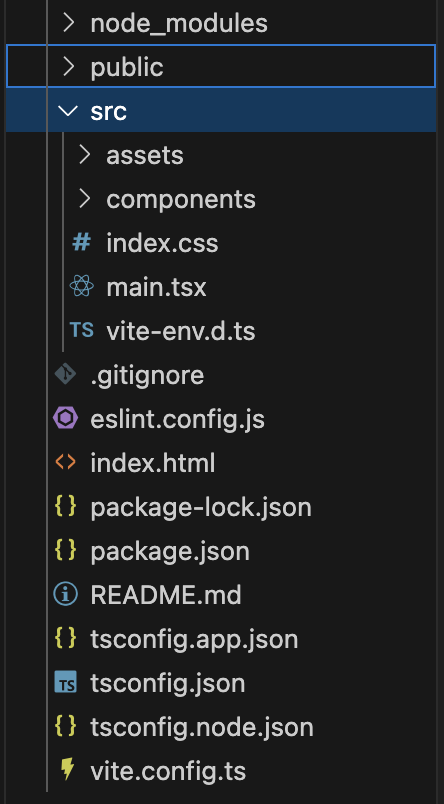

### Superior Semantic Foundations

Claude's HTML structure immediately stood out for its improved use of semantic elements. It correctly used semantic elements that help ATs to provide context and navigate, like `<h2>`, `<fieldset>`, and `<label>`, using the `<h2>` as the label for the fieldset. It also had better labelling on the delete buttons, adjusting the `aria-label` attribute to match the value of the email input.

```html
<h2 id="r0-heading">Additional email recipients (up to 20)</h2>
<fieldset class="formFieldset" aria-labelledby="r0-heading">
  <label for="r0-email-0">Email address</label>
  <!-- Form content -->
</fieldset>
```

### Innovative Accessibility Patterns

Claude demonstrated several sophisticated accessibility approaches:

#### Smart Button Labeling

As mentioned, the delete buttons dynamically referenced email values: `"Remove john@example.com"` instead of generic numbering. This created meaningful context for screen reader users. Though the dynamic fields didn't have their own labels, screen readers announce the field's value if there is no label (see the AOM image below).

#### Live Region Implementation

Most impressively, Claude was the only tool to implement `aria-live="polite"` for the usage counter, which would help to announce changes to screen reader users:

```html
<span aria-live="polite">2 of 20 used</span>
```

While not "perfect" (a role of `status` or, better, an `<output>` element would be more appropriate for form-related announcements), this showed quite advanced understanding of dynamic content accessibility requirements. Claude chose to increment and decrement this value as soon as text was added to a field. Consequently, it was possible to have 3 fields on screen and have this value set to "1 of 20 used".

#### Focus Management

Claude solved the problem of screen reader orientation by automatically focusing new fields when they were added, providing clear indication of where users should direct their attention next.

### Claude Accessibility Testing Results

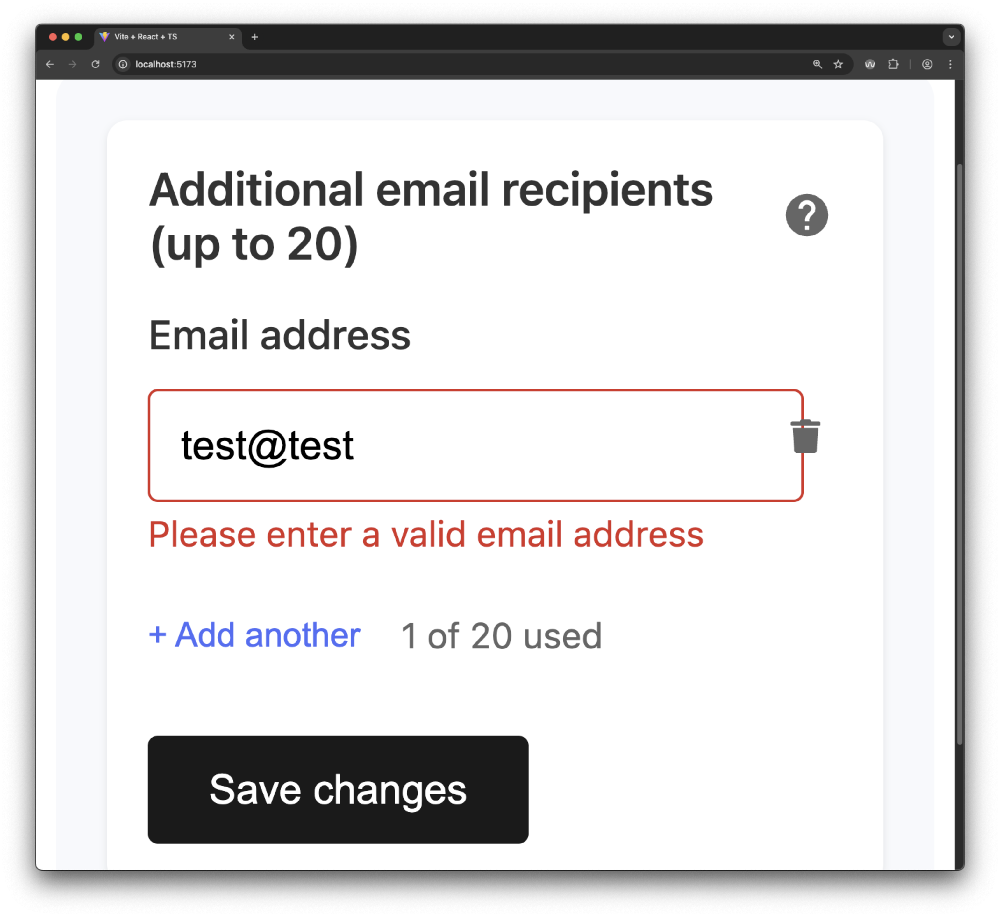
Claude's application handles 400% zoom without loss of functionality.
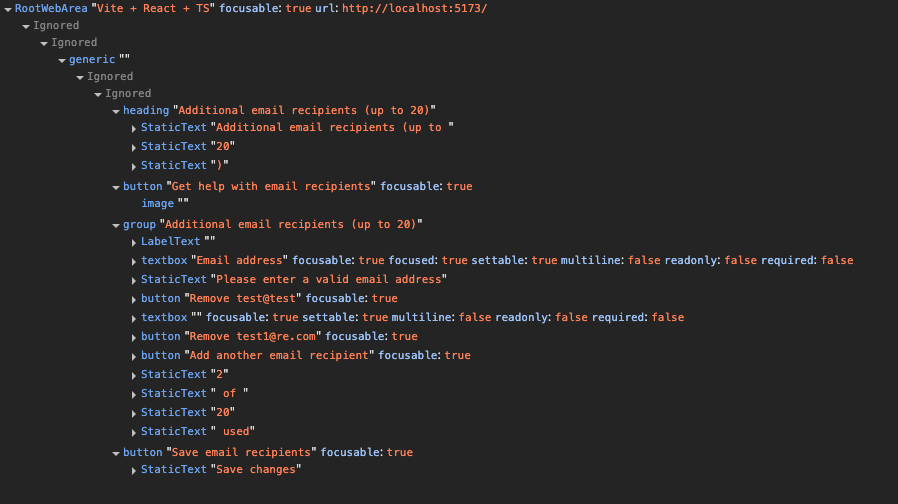
Claude's AOM snapshot shows a lot of detail, which is a good sign for accessibility.
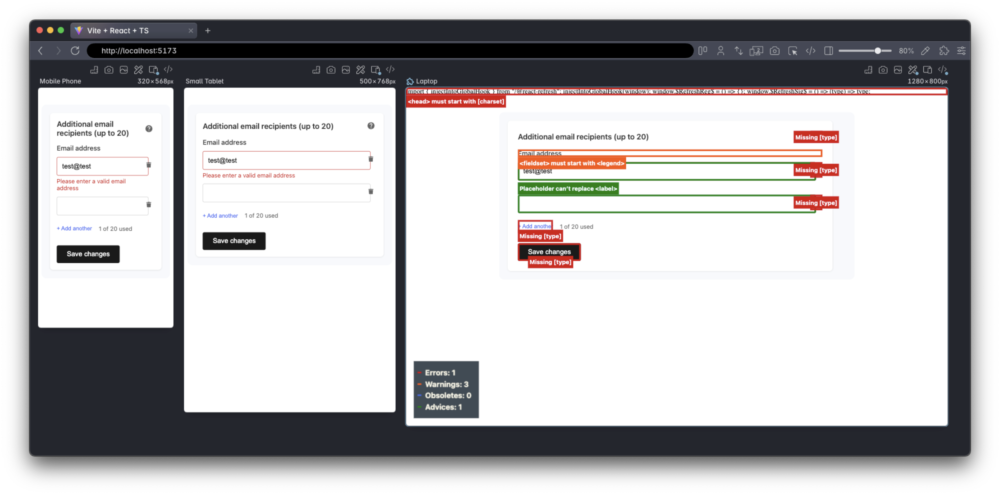
Polypane's accessibility CSS highlights show 1 error (which is rather because of badly setup vite). The fieldset element warning, as we can see from the AOM, is less of an issue. Some best practices on adding a type attribute to the buttons are also shown.
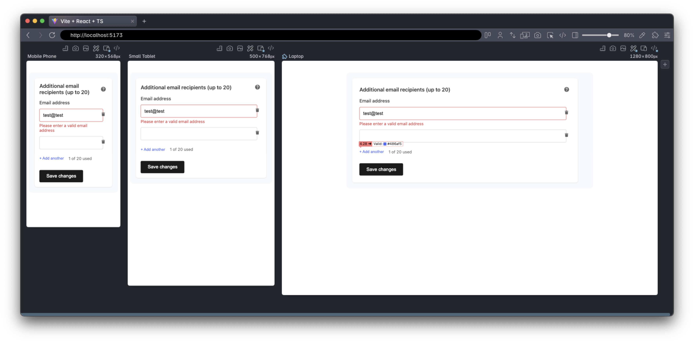
Polypane's contrast checker highlights show 1 error, where the blue of the "Add another" button is not quite dark enough.
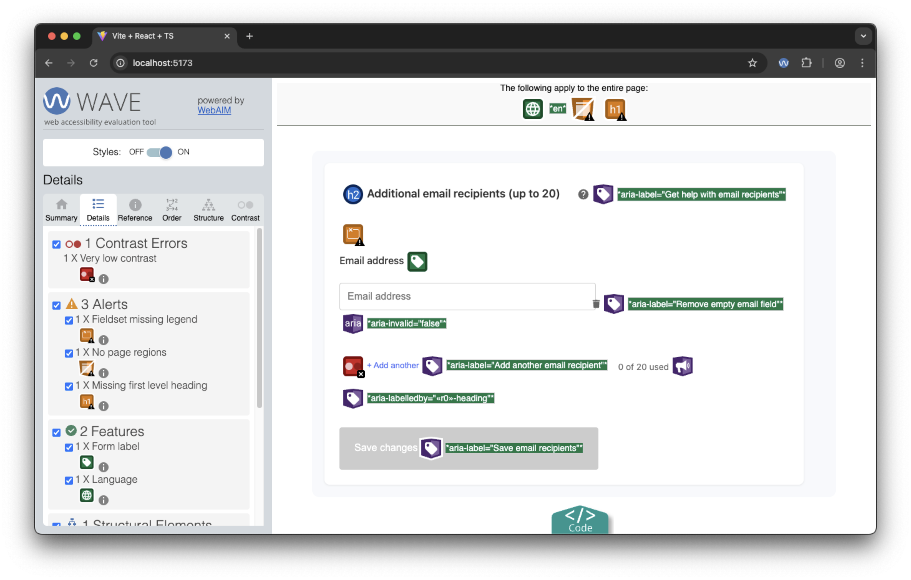
The WAVE browser extension highlights the same issues as the Polypane checks.
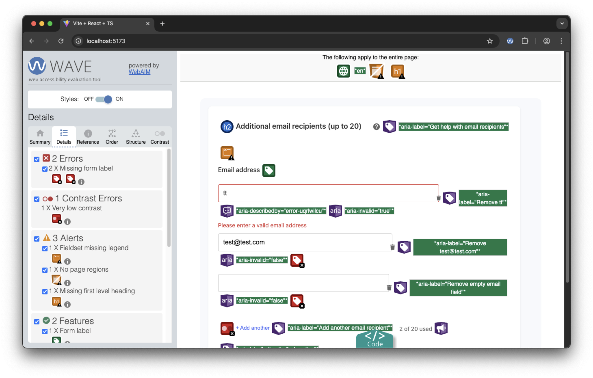
WAVE highlights the same lack of labels on the additional email recipients input fields as V0, but, as we will see, this ends up not being a major issue.

### Screen Reader Experience: Largely Successful

Using the screen reader, the proper heading announcement and using that to label the fieldset, provides good context and clear grouping of the fields.

The initial input field is properly labelled and usage is clear. When moving past that, the meaningful delete button label with the field value, makes it clear what is being deleted. The "Add another" button is also labelled clearly, and when clicked, the new input field is properly labelled and focused, with the screen reader announcing "Email address". The consistent initial pattern and focus management results in a smooth and intuitive experience, despite the lack of labels on the additional input fields. Notably, despite the `aria-live`, there was no announcement of new email fields.

### Voice Control: Smooth operator

Claude's implementation worked smoothly with voice control, though overly descriptive `aria-label` attributes sometimes made voice commands more complex than necessary, making number selection more useful.

### Claude Assessment: Accessibility Innovation with Room for Polish

**Strengths:**

- Decent semantic HTML structure with proper headings and fieldset grouping
- Innovative accessibility patterns like dynamic button labeling
- Good focus management for dynamic interactions
- Attempted live region announcements for screen reader users
- Thoughtful UX additions (help button, proper error handling)

**Areas for Improvement:**

- Visual design less polished than competitors
- Missing labels on dynamically added fields
- `aria-live` implementation could be improved with `<output>` element and the inclusion of the `<form>` element.
- Some inconsistencies in implementation patterns

**Bottom Line:** Claude demonstrated a better level of accessibility principles and semantic HTML. Importantly, of all the models, it "understood" the purpose of count summary, and correctly tried to make it announce new values for screen reader users. While not perfect, it showed clear reasoning about assistive technology needs — representing something like a "mid-level developer" approach to HTML & accessibility.

## Google AI Studio: The Comprehensive Form

Google AI Studio, while not quite as visually polished as V0, implemented the most technically correct form structure. It was the only tool to use a proper `<form>` element (with the `novalidate` attribute), and demonstrated understanding of custom form validation patterns.

### First Impressions

Google AI Studio is rather like V0 in interface, and is equally easy to use. It is one of very many tools that Google is providing, as they work out what works best for their users. They also have Gemini cli, which is very like Claude code, so you have the full gamut of interfaces, depending on your preferences.

The project structure was the most efficient (81.7 MB across 2,675 files) and it had the most pleasant user experience for the field validation.

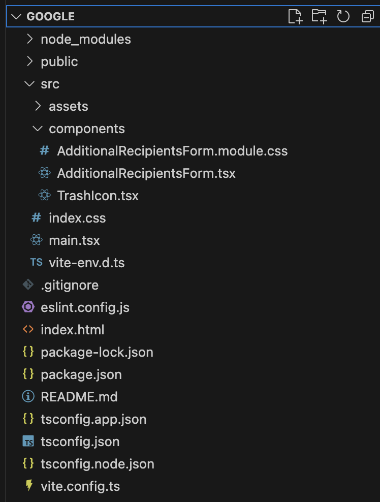

### Standout Accessibility Features

#### Universal Field Labeling

Unlike the other tools, Google AI Studio provided proper labels for every input field, albeit repeated and not unique. It also used a proper heading and a form element to group related inputs together. This also made meaningful the type attributes on the buttons.

```html
<form novalidate="">
  <h2 class="_title_1379u_13">Additional email recipients (up to 20)</h2>
  ...
  <label for="recipient-uuid-1">Email address</label>
  <input id="recipient-uuid-1" type="email" required />
  ...
  <label for="recipient-uuid-2">Email address</label>
  <input id="recipient-uuid-2" type="email" required />
  ...
  <button type="submit" disabled="">Save changes</button>
  ...
</form>
```

#### Superior Validation UX

For me, the most interesting thing is that Google chose a different pattern for field validation than the standard HTML5 implementation. It is far and away the most user-friendly pattern out of them because it only alerts users when they've finished typing their email address if it is not valid. Equally, it provides immediate feedback when the email address is valid, reducing the need for users to wait for a response. Finally, the Save button is enabled only when all fields are valid, so it is not possible to accidentally save incomplete information by pressing the return button.

#### Intelligent Button Labeling

Like Claude, delete buttons referenced specific email content: `"Delete email recipient john@example.com"`, providing clear context for all users. This does a lot to improve the user experience and context when using ATs.

### Google Accessibility Testing Results

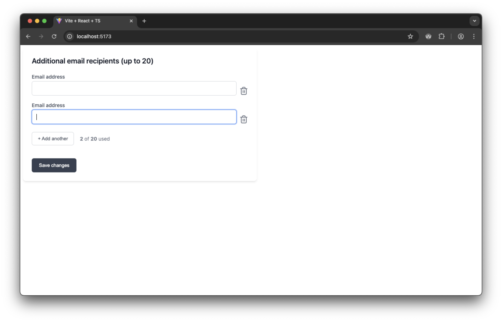
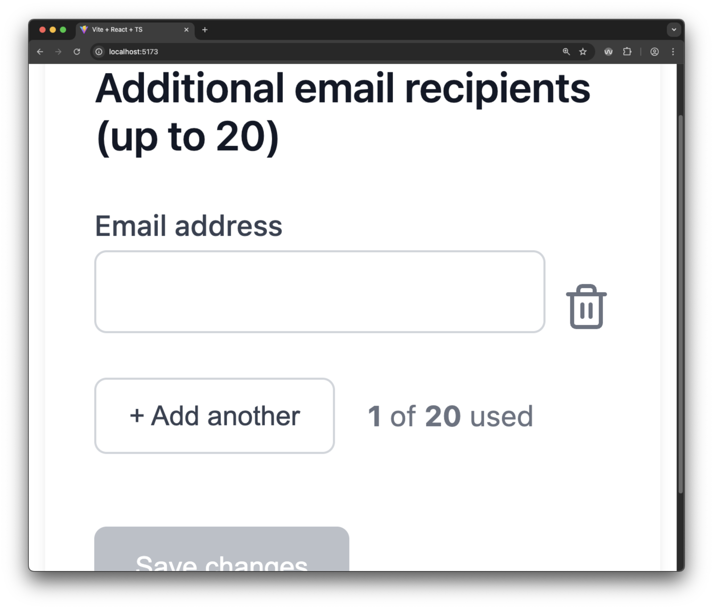
Google's app had no issues with 400% zoom.
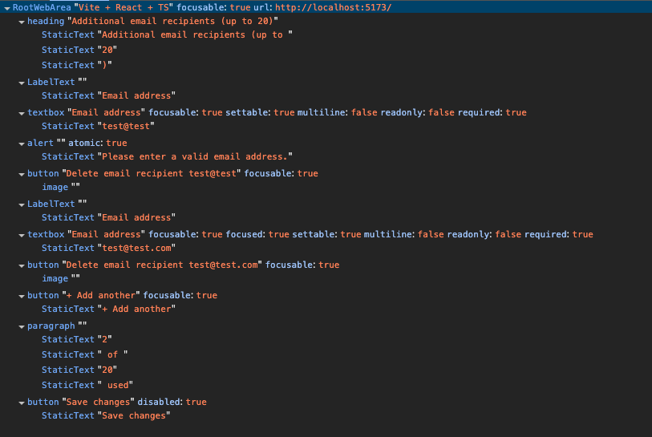
The AOM for Google's app is well-structured and detailed, making it easy to navigate and understand.
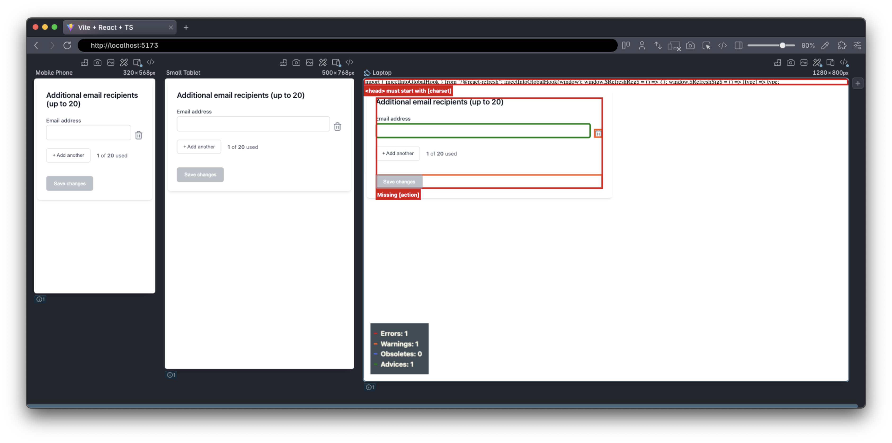
Polypane's accessibility CSS highlights a missing `action` on the form.
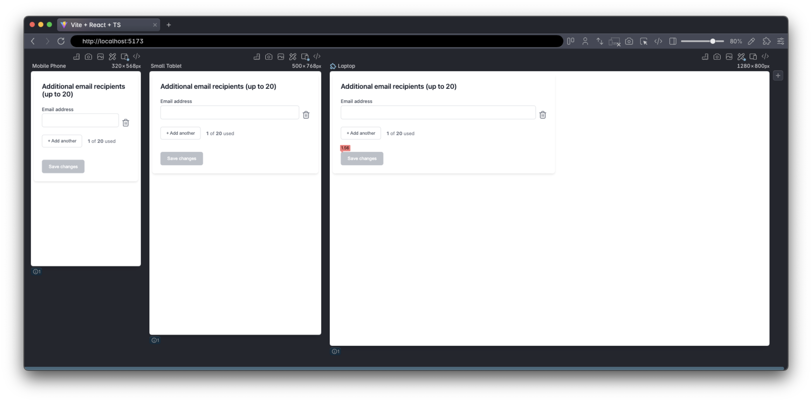
Polypane's contrast checker highlights a low contrast ratio between the text and background color of the disabled save button.
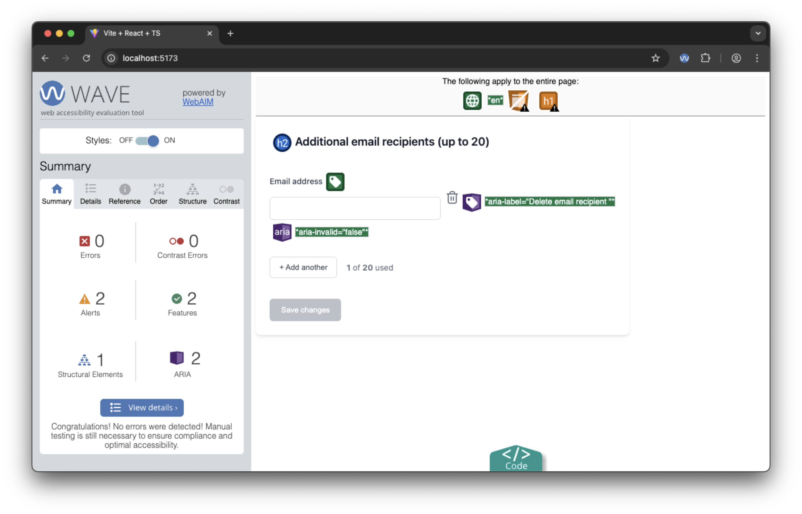
The WAVE extension doesn't highlight any errors with a single input, not even the colour contrast on the button.
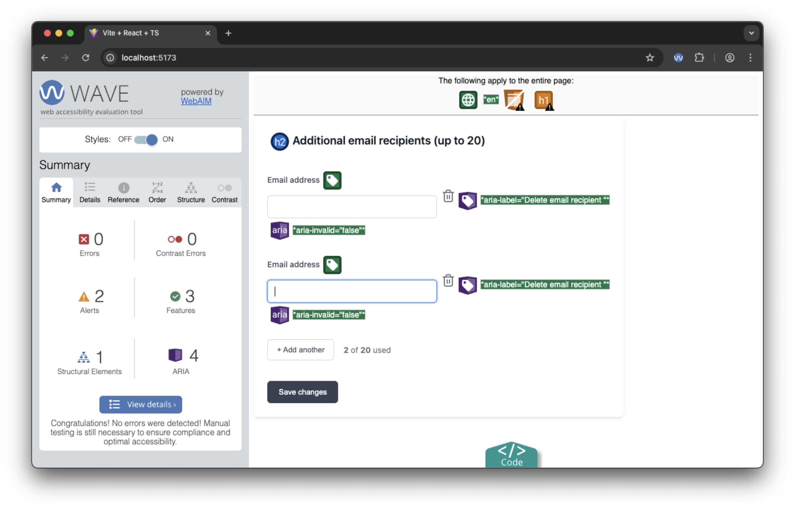
Equally, the WAVE extension doesn't highlight any errors with multiple inputs.

### Screen Reader Experience: A Fine Standard

Using a screen reader, the form is navigable and understandable.
Every field is labelled and announced and there is a logical tab order throughout the interface. Most outstanding are the meaningful error messages, announced at a useful time. Clear button descriptions with dynamic content also provide all the context necessary. Finally, the focus management feels intuitive and easy to use, despite the new field count not being announced.

### Google Voice control results

Using Voice Control, the form is easily navigable, though the labelling of the fields being identical means that the user has to use numbers or the "next"/"previous" commands to select the field they want to edit.

### Google AI Studio Assessment: The Accessibility Winner

**Strengths:**

- Only tool to use proper `<form>` element with semantic structure
- Universal field labeling — every input has a label, albeit not unique
- Great validation UX
- Excellent error handling with appropriate timing
- Consistent patterns throughout the implementation
- Clean, efficient codebase

**Minor Limitations:**

- Visual design, while functional, was not pixel-perfect
- Usage counter still lacks live region announcements (though less critical given the focus management)
- Could use `fieldset` and `legend` elements for better grouping and labeling

**Bottom Line:** Google AI Studio produced the most usable implementation overall, demonstrating remarkable "thought" in the UX of the form element validation. The markup was largely semantic and accessible. It represents something along the lines of an "UX & accessibility-aware experienced mid-level developer".

## Key Findings and Analysis

### Working, but not working

The three tools created visually "working" applications (with some flaws) but fell across a wide range of usability when it came to ATs.

1. **V0**: Visually polished but fundamentally flawed, both in accessibility and functionality.
2. **Claude code**: Created an application with minor visual flaws (and a help button that had no functionality), but a good semantic structure with accessibility awareness and a functional AT experience.
3. **Google AI Studio**: Made a functionally inclusive application with a solid technical foundation.

An important takeaway, was that it was **not possible to judge how well they performed in terms of accessibility by their visual performance**. Furthermore, AI are by definition, not deterministic - so we would not necessarily get the same output twice in a row. Another notable facet of this work is how the **automated tools did not always reflect the lived experience** navigating the UI. Consequently, it is crucial to review the accessibility carefully, ideally with a **user testing** approach.

### The Bigger Picture: What This Means for AI-Assisted Development

At a higher level, from this experiment, we can broadly say (perhaps unsurprisingly) that these tools represent a quick starting point for our work. Equally, again unsurprisingly, their accessibility output (even when prompted) sadly reflects the paucity of good examples in the code they were trained on. Apart from that, the one real "force multiplier" that these examples show is that they can sometimes come up with innovative patterns or considerations that we may not have thought of, which is really the power of having more than one "brain" on the job.

#### The Development Implications

For developers using AI coding assistants:

1. **Review Generated Code Critically**: Assume accessibility is NOT handled completely correctly
2. **Automate and Test with Real Users**: Automated tools catch some issues early, but real ATs and real users to test, show the real-world UX of the code
3. **Understand the Patterns**: Learn the accessibility concepts AI struggles with
4. **Iterate and Improve**: Use initial AI output as a starting point, _not a final solution_, and be sure to explicitly request accessibility features and testing

## Conclusion: The Path Forward

This analysis reveals both the promise and limitations of current AI coding tools when it comes to accessibility. While none achieved perfect accessibility out of the box, each demonstrated different strengths that point toward best practices for both developers and AI tool creators.

The most encouraging finding is that when properly prompted with accessibility requirements, AI tools can implement some useful patterns. Google AI Studio's comprehensive form approach and Claude's semantic structure show that the foundational knowledge exists within these systems, but there is not enough coherent training on them.

The gaps in dynamic content handling, live region implementation, and consistent semantic structure also points to a missing "holistic" understanding or capacity in the tools.

### The Future of Accessible AI Development

As they continue to evolve, the potential for AI to normalise inclusive coding practices is immense. With better training, clearer patterns, and improved understanding of accessibility requirements, AI could help ensure that inclusivity becomes the default rather than an afterthought.

The key is not treating something that looks good as a solution; it might not work at all for some people. The goal isn't just functional code, but inclusive digital experiences that serve everyone, including the AI assistants that search the web for us.
